# ADR-0021 — Trusted Beta onboarding becomes the permanent GuvFX onboarding (dedicated-runtime by default)

- **Status:** **APPROVED IN PRINCIPLE — Sponsor (Nuno), 2026-07-29.** Emerged from Customer Zero
  certification: the beta onboarding journey was not fully wired, and the Sponsor decided to make the
  Trusted Beta flow the single permanent onboarding rather than maintain a separate beta journey.
  Repository implementation authorised through the normal governance pipeline (tests + adversarial
  review + make check + CI + merge). **Production deployment remains a Sponsor gate** — it must pass the
  Golden Execution Reference STOP-check (routing, assignments, execution controls, runtime unchanged)
  before and after deploy.
- **Date:** 2026-07-29 · **Programme:** Customer Zero certification → permanent onboarding.
- **Supersedes/absorbs:** the per-user beta-admission gate (`is_admitted_beta_tester`) and the
  `beta_onboarding_open()` global gate as *eligibility* mechanisms. Retains ADR-0016/0017 (runtime
  isolation + on-demand tasks), ADR-0020 (multi-account routing), ADR-0019 (credential storage).
- **Relates to:** `backend/onboarding/services.py`, `backend/trading/views.py` (`perform_create`,
  `_maybe_enqueue_beta_provisioning`), `backend/terminal_provisioning/beta_capacity.py`,
  `beta_activation.py`, `backend/strategies/views.py` (arm), `backend/billing/beta.py`,
  `frontend/.../onboarding/*`, `.claude/rules/architecture.md` ("no silent architecture replacement").

## Context

Admission (`is_admitted_beta_tester`) was serving two distinct jobs: an **eligibility gate** (who may
onboard/arm/provision) and a **cohort selector** (admitted → dedicated owned-runtime path; everyone else
→ legacy shared-instance path). Combined with `beta_onboarding_open()` (default CLOSED), a normal
customer could not complete "Connect broker" (`OnboardingStepError: "Beta onboarding is not open yet."`).
Customer Zero (`beta.guvfx01@gmail.com`, genuine email verification confirmed) hit exactly this.

## Decision (programme decisions, Sponsor 2026-07-29)

1. **Trusted Beta is an operational state, not an architectural concept.** There is ONE onboarding path.
2. **Dedicated runtime provisioning is the default customer execution model.** The legacy shared-instance
   path is removed for customers (staff/Nuno path preserved).
3. **Broker validation occurs during runtime provisioning by establishing a genuine MT5 session**
   (`PROVISIONING_REQUIRE_BROKER_LOGIN=1`). The runtime's real broker login *is* the validation.
4. **Customer-visible progress is state-driven, not operation-driven** — the UI derives the current step
   from durable platform state (onboarding flags + `AccountRuntime.state`) and advances automatically.
5. **Duplicate broker submissions and provisioning requests are idempotent at BOTH the application and
   database layers** — a repeat returns the existing account/runtime, never a duplicate.
6. **Backend reason codes remain structured** (`{ok, reason, detail}`); the frontend owns wording.
7. **Customer-facing wording is owned by the frontend.**
8. **Eligibility = operational health, not an allowlist:** `onboarding_available()` =
   `registration_enabled` AND `runtime_capacity_available` AND `provisioning_service_healthy`.

## Onboarding state model

The onboarding state is **derived** from durable records, never stored as a single mutable "step":
`UserOnboardingState` (email_verified, risk_accepted, plan_selected, strategy_assigned, onboarding_completed)
+ the customer's `TradingAccount` + its `AccountRuntime.state`. The frontend polls
`/api/onboarding/account-status/` and renders the derived state.

```mermaid
stateDiagram-v2
    [*] --> Registered: register (registration_enabled)
    Registered --> EmailVerified: enter emailed code (genuine SMTP)
    EmailVerified --> TermsAccepted: accept risk + plan
    TermsAccepted --> BrokerAdded: submit MT5 details (idempotent create)

    BrokerAdded --> Provisioning: onboarding_available() ✓ (auto-enqueue reserve_beta_slot)
    BrokerAdded --> CapacityBlocked: capacity full / provisioning unhealthy

    CapacityBlocked --> Provisioning: capacity frees (reconcile re-enqueue)

    Provisioning --> RuntimeReady: runtime RUNNING + MT5 broker session established (validated)
    Provisioning --> ProvisioningFailed: materialise/launch error
    Provisioning --> ValidationFailed: MT5 broker login rejected

    ValidationFailed --> BrokerAdded: customer re-enters credentials (idempotent update)
    ProvisioningFailed --> Provisioning: operator/auto retry (bounded)

    RuntimeReady --> StrategySelected: customer selects strategy
    StrategySelected --> TradingEnabled: Enable Trading (arm; AUTO_DEMO assignment)
    TradingEnabled --> Active: dashboard reflects live state
    Active --> [*]

    note right of Provisioning
      "Validate credentials" is fulfilled here:
      the runtime logs into the customer's broker.
      Idempotent: a duplicate request returns the
      existing QUEUED/RUNNING runtime, never a new slot.
    end note
    note right of CapacityBlocked
      Not an allowlist — a truthful operational
      state. Resolved by freeing/adding a slot.
    end note
```

**Legal states:** `Registered, EmailVerified, TermsAccepted, BrokerAdded, Provisioning, CapacityBlocked,
RuntimeReady, ProvisioningFailed, ValidationFailed, StrategySelected, TradingEnabled, Active`.
No transition skips a predecessor; every transition is guarded by durable state (never a client claim).

## Architectural changes (minimum set)

**Backend**
- `billing/beta.py`: add `onboarding_available() -> (bool, reason)`; retain `BETA_RUNTIMES_ENABLED` /
  `BETA_SELF_SERVE_ARM_ENABLED` as operational kill-switches. `is_admitted_beta_tester` / `BetaTester`
  retained but **no longer consulted for onboarding eligibility** (may back a future invite feature).
- `onboarding/services.py`: `mark_account_connected` + `mark_strategy_assigned` gate on
  `onboarding_available()` (not `beta_onboarding_open()`), and use the **runtime-ready** semantics for all
  non-staff. Retire `_apply_beta_admission` (email verification is genuine for everyone).
- `trading/views.py`: `perform_create` non-staff branch **always** dedicated-runtime
  (`mt5_instance=None` + idempotent `_maybe_enqueue_beta_provisioning`); **staff/Nuno branch unchanged**.
  Account create is `get_or_create` on the idempotency key.
- `terminal_provisioning/beta_activation.py` + `reconcile_beta_provisioning`: chokepoint gates on
  `onboarding_available()` + `cohort==BETA` (drop the admission check). `reserve_beta_slot` is already
  idempotent (returns the held runtime).
- `PROVISIONING_REQUIRE_BROKER_LOGIN=1` in the provisioning path so validation is a real MT5 session;
  `validation_status` / `broker_connected` become truthful.
- Structured reason codes: `registration_closed, capacity_full, provisioning_unhealthy,
  runtime_provisioning, runtime_failed, validation_failed`.

**Frontend**
- Onboarding orchestration: create account (idempotent) → poll `account-status` → advance when
  `RuntimeReady`; render a "Validating & provisioning…" state; map reason codes to friendly copy.

## Migration impact
- **One additive migration:** `UniqueConstraint` on `TradingAccount (user, account_number, broker_server)`
  and `(user, account_number, broker_name)` for DB-layer idempotency. Data-preserving; a pre-check
  de-duplicates first (Customer Zero's account #11 is the only customer account). Reversible.
- No data migration for gate removal (code-only). `BetaTester` rows retained. Cohort unchanged
  (`BETA` remains the customer cohort; `PRODUCTION`/Nuno untouched). Optional cosmetic rename deferred.

## Compatibility with the Golden Execution Reference — LOW risk
- Nuno is staff/superuser → bypasses onboarding gates before and after (staff branches preserved).
- All capacity/activation gates are `cohort==BETA`-scoped → never touch Nuno's `PRODUCTION` runtime.
- Routing/execution untouched (ADR-0020 fan-out already Golden-preserved).
- **Implementation guardrail:** the deploy must pass the Golden Reference baseline STOP-check
  (routing, assignments, execution controls, runtime, 0 unexpected positions/orders) + an explicit
  "Nuno path unchanged" test. STOP on any structural change.

## Consequences
- **Simplifies public launch:** one path; capacity/health throttle replaces the allowlist bottleneck;
  idempotency + friendly errors + state-driven UI are production-quality prerequisites paid early.
- **Remaining public-launch gap (out of scope, flagged):** real billing/entitlement + payment (a BETA
  plan is auto-granted today). This ADR neither touches nor blocks it.
- **Reversible:** re-introducing an eligibility gate is a one-line change to `onboarding_available()`.

## Alternatives considered
- *Keep a separate beta journey* — rejected: dual-path tech debt; allowlist doesn't scale to public.
- *Broker-independent provisioning (no validation)* — rejected: "credentials validated" would be untrue.
- *Pre-provision shared validator* — rejected: more moving parts than validating via the real runtime.
