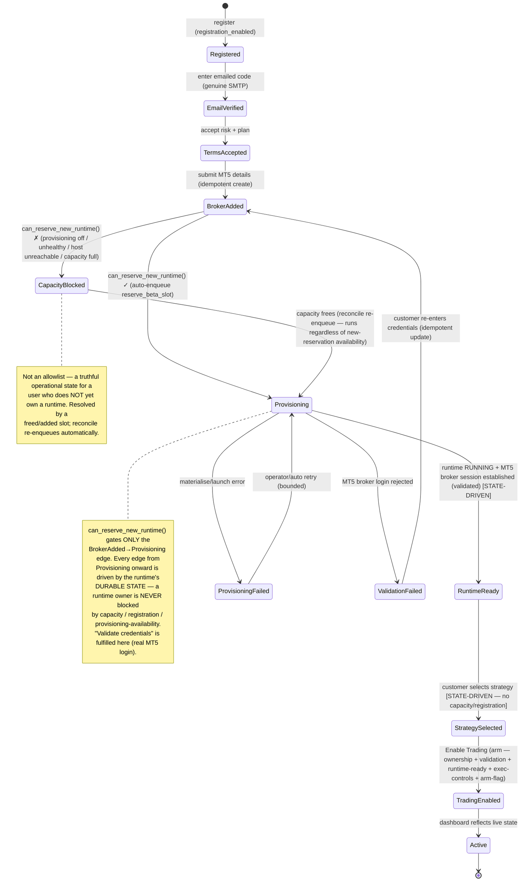

# ADR-0021 — Trusted Beta onboarding becomes the permanent GuvFX onboarding (dedicated-runtime by default)

- **Status:** **APPROVED IN PRINCIPLE — Sponsor (Nuno), 2026-07-29.** Emerged from Customer Zero
  certification: the beta onboarding journey was not fully wired, and the Sponsor decided to make the
  Trusted Beta flow the single permanent onboarding rather than maintain a separate beta journey.
  Repository implementation authorised through the normal governance pipeline (tests + adversarial
  review + make check + CI + merge). **Production deployment remains a Sponsor gate** — it must pass the
  Golden Execution Reference STOP-check (routing, assignments, execution controls, runtime unchanged)
  before and after deploy.
- **Date:** 2026-07-29 · **Programme:** Customer Zero certification → permanent onboarding.
- **Supersedes/absorbs:** the per-user beta-admission gate (`is_admitted_beta_tester`) and the
  `beta_onboarding_open()` global gate as *eligibility* mechanisms. Retains ADR-0016/0017 (runtime
  isolation + on-demand tasks), ADR-0020 (multi-account routing), ADR-0019 (credential storage).
- **Relates to:** `backend/onboarding/services.py`, `backend/trading/views.py` (`perform_create`,
  `_maybe_enqueue_beta_provisioning`), `backend/terminal_provisioning/beta_capacity.py`,
  `beta_activation.py`, `backend/strategies/views.py` (arm), `backend/billing/beta.py`,
  `frontend/.../onboarding/*`, `.claude/rules/architecture.md` ("no silent architecture replacement").

## Context

Admission (`is_admitted_beta_tester`) was serving two distinct jobs: an **eligibility gate** (who may
onboard/arm/provision) and a **cohort selector** (admitted → dedicated owned-runtime path; everyone else
→ legacy shared-instance path). Combined with `beta_onboarding_open()` (default CLOSED), a normal
customer could not complete "Connect broker" (`OnboardingStepError: "Beta onboarding is not open yet."`).
Customer Zero (`beta.guvfx01@gmail.com`, genuine email verification confirmed) hit exactly this.

## Decision (programme decisions, Sponsor 2026-07-29)

1. **Trusted Beta is an operational state, not an architectural concept.** There is ONE onboarding path.
2. **Dedicated runtime provisioning is the default customer execution model.** The legacy shared-instance
   path is removed for customers (staff/Nuno path preserved).
3. **Broker validation occurs during runtime provisioning by establishing a genuine MT5 session**
   (`PROVISIONING_REQUIRE_BROKER_LOGIN=1`). The runtime's real broker login *is* the validation.
4. **Customer-visible progress is state-driven, not operation-driven** — the UI derives the current step
   from durable platform state (onboarding flags + `AccountRuntime.state`) and advances automatically.
5. **Duplicate broker submissions and provisioning requests are idempotent at BOTH the application and
   database layers** — a repeat returns the existing account/runtime, never a duplicate.
6. **Backend reason codes remain structured** (`{ok, reason, detail}`); the frontend owns wording.
7. **Customer-facing wording is owned by the frontend.**
8. **Eligibility = STAGE-SPECIFIC operational predicates, not an allowlist and NOT one universal gate.**
   Capacity / registration-open / provisioning-availability must **never** block a customer who already
   owns a runtime — those apply only to allocating a *new* runtime. Each transition has its own named
   predicate (see "Operational gate model" below).

## Onboarding state model

The onboarding state is **derived** from durable records, never stored as a single mutable "step":
`UserOnboardingState` (email_verified, risk_accepted, plan_selected, strategy_assigned, onboarding_completed)
+ the customer's `TradingAccount` + its `AccountRuntime.state`. The frontend polls
`/api/onboarding/account-status/` and renders the derived state.

**Legal states:** `Registered, EmailVerified, TermsAccepted, BrokerAdded, Provisioning, CapacityBlocked,
RuntimeReady, ProvisioningFailed, ValidationFailed, StrategySelected, TradingEnabled, Active`.
No transition skips a predecessor; every transition is guarded by durable state (never a client claim).

## Operational gate model (stage-specific — corrected)

There is **no universal gate**. Each transition consults only the predicates it needs. Capacity /
registration-open / provisioning-availability appear **only** on the new-runtime edge.

| Transition | Predicate(s) | Capacity? | Registration? |
|---|---|---|---|
| Create **new user account** (register) | `registration_allowed()` | no | **yes (only here)** |
| **Login** | none (any existing user) | no | no |
| Email verify / risk / plan | step prerequisites only | no | no |
| Add broker account (create record) | idempotent create; **no** eligibility gate | no | no |
| **Reserve a NEW runtime** (BrokerAdded→Provisioning) | `can_reserve_new_runtime(user)` = provisioning-enabled + provisioner-heartbeat-fresh + host-agent-reachable + **not already-owning** + capacity | **yes (only here)** | no |
| **Existing-runtime progression** (RuntimeReady, StrategySelected…) | runtime **durable state** (`runtime_ready` + `_runtime_progress_reason`) | no | no |
| Strategy selection / Enable Trading (arm) | ownership + account validation + runtime readiness + execution controls + `BETA_SELF_SERVE_ARM_ENABLED` | no | no |
| Reconciliation | BETA runtime + owner present — **runs for existing customers regardless** | no | no |

`can_reserve_new_runtime` short-circuits to `already_owned` when the user holds an active/held runtime, so
an owner is a no-op re-drive (`reserve_beta_slot` returns their existing runtime), never blocked.

## Architectural changes (minimum set)

**Backend**
- `billing/beta.py`: **stage-specific predicates** — `registration_allowed()`, `provisioning_service_healthy()`
  (kill-switch + `_provisioner_heartbeat_fresh()`), `host_agent_reachable()`, `runtime_capacity_available()`,
  `user_holds_runtime()`, `can_reserve_new_runtime(user) -> (ok, reason)`. `is_admitted_beta_tester` /
  `BetaTester` retained but **never consulted for eligibility**; `beta_onboarding_open()` demoted to
  staff/back-compat only.
- `onboarding/services.py`: `mark_account_connected` (non-staff) is **pure state-driven** via
  `_mark_beta_runtime_ready` → `_runtime_progress_reason(runtime)` (no capacity/registration gate);
  `mark_strategy_assigned` governed by the existing `StrategyAssignment` only. `_apply_beta_admission`
  retired. **Staff/Nuno legacy path unchanged.**
- `trading/views.py`: `perform_create` non-staff branch is **idempotent** (`get_or_create` on the
  normalised key; existing account returned, provisioning re-driven idempotently) + dedicated-runtime
  default; `_maybe_enqueue_beta_provisioning` drops admission, guards a duplicate PROVISION enqueue.
  **Staff branch unchanged.** New-runtime allocation is authoritatively gated + enforced atomically in
  `reserve_beta_slot`; `can_reserve_new_runtime` is the entry pre-check that surfaces the reason.
- `terminal_provisioning/beta_activation.py` + `reconcile_beta_provisioning`: drop the per-user admission
  check (chokepoint keeps `beta_runtimes_enabled` + `cohort==BETA` + owner + cap). Reconcile runs for any
  owned BETA runtime.
- **PR B only:** `PROVISIONING_REQUIRE_BROKER_LOGIN=1` — provisioning establishes a real MT5 session;
  `validation_status`/`broker_connected` become truthful.
- Structured reason codes: `registration_closed, provisioning_disabled, provisioner_unhealthy,
  host_unreachable, capacity_full, runtime_pending, runtime_provisioning, capacity_blocked, runtime_failed,
  runtime_not_ready, validation_failed, no_broker_account`.

**Frontend**
- Onboarding orchestration: create account (idempotent) → poll `account-status` → advance when the runtime
  is ready; render a "Validating & provisioning…" state; map reason codes to friendly copy.

## PR boundaries (jointly certified — PR B not deferred)

**PR A** — admission removal + permanent dedicated-runtime path + account/provisioning idempotency +
DB constraints (+ normalisation) + state-driven frontend orchestration + structured reason codes + friendly
errors + full tests **including Golden-Reference preservation**. No host risk beyond existing provisioning.

**PR B** — genuine MT5 broker-login validation during provisioning (`PROVISIONING_REQUIRE_BROKER_LOGIN=1`),
isolated host verification, failure/retry/timeout/credential-safety tests, **no-order proof**, rollback
evidence. A **separate bounded risk packet/PR** — but **part of the Customer Zero release**.

**PR A MUST NOT deploy independently as the certified permanent onboarding.** PR A and PR B are merged and
**jointly certified**, then STOP at the production-deployment gate for Sponsor approval (Golden-Reference
STOP-check before + after).

## Migration / normalisation plan (idempotency constraint)

**Order of operations (all in PR A):**
1. **Audit first (read-only):** query for existing duplicates by the normalised key before writing any
   constraint — `GROUP BY user, TRIM(account_number), broker_server, TRIM(broker_name) HAVING COUNT(*)>1`.
   Expectation: none (Customer Zero's account #11 is the only customer account; Nuno's are staff/separate).
   If any surface, resolve explicitly (keep the active/newest, deactivate the rest) — never silently.
2. **Normalise on write:** `account_number` and `broker_name` are `strip()`-normalised at intake
   (serializer/`perform_create`) so the stored value is canonical. **Case is preserved** — MT5 server
   names are case-sensitive; normalisation is whitespace-only. The idempotency lookup uses the same
   normalised values.
3. **Null-safe conditional uniqueness** — two **partial** `UniqueConstraint`s (Postgres treats NULLs as
   distinct, so a single constraint spanning a nullable FK would not enforce the free-text path):
   - `uniq_acct_fk` — `(user, account_number, broker_server)` `WHERE broker_server IS NOT NULL`.
   - `uniq_acct_freetext` — `(user, account_number, broker_name)` `WHERE broker_server IS NULL AND broker_name <> ''`.
4. **Data-preserving + reversible.** A `RunPython` pre-check aborts the migration loudly if step 1 finds
   duplicates (so they are handled before the constraint lands). Reverse drops the constraints only.

**Idempotency proofs (tests in PR A):**
- Repeated submission of the same `(user, login, broker)` returns the **existing** account (200/── same id)
  and the **existing** provisioning state — no second account, no second slot, no duplicate PROVISION job.
- Concurrent submissions cannot duplicate: `perform_create` already takes `select_for_update` on the user
  row (serialises the two creates); the partial unique constraints are the DB-layer backstop
  (`IntegrityError` → caught → return existing).

**Gate-removal migrations:** none (code-only). `BetaTester` rows retained; cohort unchanged (`BETA` remains
the customer cohort, `PRODUCTION`/Nuno untouched); cosmetic rename deferred.

## Compatibility with the Golden Execution Reference — LOW risk
- Nuno is staff/superuser → bypasses onboarding gates before and after (staff branches preserved).
- All capacity/activation gates are `cohort==BETA`-scoped → never touch Nuno's `PRODUCTION` runtime.
- Routing/execution untouched (ADR-0020 fan-out already Golden-preserved).
- **Implementation guardrail:** the deploy must pass the Golden Reference baseline STOP-check
  (routing, assignments, execution controls, runtime, 0 unexpected positions/orders) + an explicit
  "Nuno path unchanged" test. STOP on any structural change.

## Consequences
- **Simplifies public launch:** one path; capacity/health throttle replaces the allowlist bottleneck;
  idempotency + friendly errors + state-driven UI are production-quality prerequisites paid early.
- **Remaining public-launch gap (out of scope, flagged):** real billing/entitlement + payment (a BETA
  plan is auto-granted today). This ADR neither touches nor blocks it.
- **Reversible:** re-introducing an eligibility gate is a one-line change to `onboarding_available()`.

## Terminology (permanent)
The legacy beta-era names are now the **standard dedicated customer-runtime path**, not a separate
architecture: `cohort=BETA` = the standard customer runtime cohort; `BETA_MAX_TESTERS` = the customer
runtime-capacity cap; `reserve_beta_slot` / `beta_activation` / `beta_worker` = the standard
dedicated-runtime reservation + activation + provisioning path. **"Trusted Beta" is an operational
rollout state, not an eligibility or onboarding architecture.** No admission check may be reintroduced
through these legacy names. (A cosmetic rename to customer-neutral identifiers is deferred, non-blocking.)

## Alternatives considered
- *Keep a separate beta journey* — rejected: dual-path tech debt; allowlist doesn't scale to public.
- *Broker-independent provisioning (no validation)* — rejected: "credentials validated" would be untrue.
- *Pre-provision shared validator* — rejected: more moving parts than validating via the real runtime.
