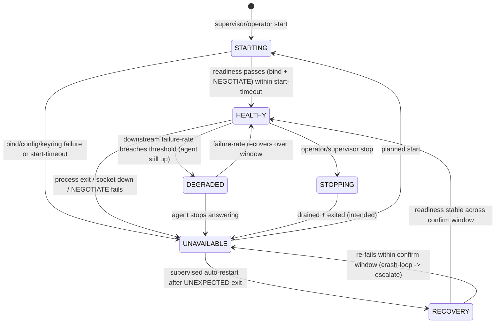

# Validation Agent — Production Hardening (authoritative operational design)

**Status:** DESIGN. Repository + documentation only — no deployment, no host change, no configuration change,
no service start, no live validation. This is the authoritative *operational* design for the beta validation
agent; it does **not** replace the forensic records, it builds on them:
[VALIDATION_OBSERVABILITY.md](VALIDATION_OBSERVABILITY.md),
[VALIDATION_RELIABILITY_EVIDENCE_MATRIX.md](VALIDATION_RELIABILITY_EVIDENCE_MATRIX.md),
[VALIDATION_IPC_RELIABILITY_INVESTIGATION.md](VALIDATION_IPC_RELIABILITY_INVESTIGATION.md), and the
lifecycle-forensics (WinSW Stopped / non-service process / no process-creation trail).

**Component under design.** `GuvFXBetaAgent` — `deploy/beta-agent/agent.py`, a bare HTTP server exposing
exactly one signed endpoint `POST /provision` (operations `NEGOTIATE`, `MATERIALISE`, `START`, `VERIFY`,
`STOP`, `TOMBSTONE`, `RELEASE`, `VALIDATE_LOGIN`), bound to a private Tailscale address `:8791`, firewall-scoped
to the backend only. There is deliberately **no unauthenticated `/health`** — health is a signed `NEGOTIATE`.

**Machine-readable companions (test-guarded):**
[health-model.json](operations/validation-agent/health-model.json) ·
[monitoring-catalogue.json](operations/validation-agent/monitoring-catalogue.json) ·
[readiness-review.json](operations/validation-agent/readiness-review.json) ·
[runbook-index.json](operations/validation-agent/runbook-index.json) ·
[runbooks.md](operations/validation-agent/runbooks.md). Executable design spec:
`backend/terminal_provisioning/validation_agent_spec.py` (imported only by tests).

---

## 1. Why this exists (one paragraph)
Forensics proved the agent has **no production lifecycle**: it is a Manual-start, `recovery=none` service that
was in fact served on 2026-08-05 by a **non-service process** which exited unnoticed, leaving `:8791` dark for
hours until a customer validation surfaced it as a (mis-labelled) `login_timeout`. The taxonomy, UX,
observability and timeline are now correct; what remains is to make the agent a **supervised, observable,
recoverable** operational component. This document defines that target state independent of the current
implementation.

## 2. Lifecycle design (WS-A)
Desired lifecycle, independent of implementation. Startup → readiness → serving; supervised restart on
unexpected exit; controlled stop with drain; operator-gated version upgrades.



- **Startup:** the supervisor launches the process → bind the exact private address (fail-closed on
  public/wrong bind) → the signing keyring/config is present → first signed NEGOTIATE succeeds → HEALTHY.
- **Readiness:** the probe ladder in §4 (process → socket → NEGOTIATE → VALIDATE_LOGIN available).
- **Health / Degraded / Unavailable:** §4.
- **Shutdown:** controlled STOP drains in-flight **mutating** ops (the per-runtime lock). **Accuracy note
  (adversarial lens 1):** the credentialed `VALIDATE_LOGIN` uses its OWN global single-flight lock and is NOT
  covered by that drain — a stop mid-login force-cuts a ~165s credentialed login; the runner destroys the
  decrypted credential out-of-band. Hardening RR-1a: wire the login validator into the drain (deny new logins
  during drain, wait out the in-flight one under a `stoptimeout` that exceeds `login_timeout_ms`+grace).
- **Restart / Recovery:** a supervisor auto-restarts on unexpected exit with bounded backoff; two failures in
  the confirm window = crash-loop → stop and escalate (never loop).
- **Maintenance:** operator-gated; drain then STOP; no live validations during maintenance.
- **Version upgrades:** operator-gated re-stage of an integrity-pinned bundle (manifest checksums, RULE-9
  ASCII/parse gate) → NEGOTIATE compat check → rollback runbook on regression.

## 3. Startup architecture comparison (WS-B)
Every mechanism actually capable of running `agent.py`, compared objectively. (No implementation here.)

| Mechanism | Auto-restart | Runs headless / survives logoff+reboot | Identity | Lifecycle (start/stop/drain) | Observability | Verdict |
|---|---|---|---|---|---|---|
| **WinSW service** (`install_service.ps1` + `winsw/GuvFXBetaAgent.xml`) — chosen | **Yes** (`<onfailure>`), not currently armed | Yes (SCM) | virtual `NT SERVICE\GuvFXBetaAgent`, no password, least-priv | Full SCM start/stop + stoptimeout drain | WinSW rolling logs + SCM events | **Rank 1 — recommended** |
| pywin32 Windows Service (`service.py`) | Yes (SCM recovery) | Yes | service account | SCM, but `agent.py` needs the wrapper (raw binPath → SCM err 1053) | SCM | Rank 2 — functionally close; repo already chose WinSW after the 2026-07-24 STOP (`docs/B3P_SERVICE_HARNESS_COMPARISON.md`) |
| Scheduled Task | Weak (task retries, no service-grade recovery) | Yes (stored creds / service SID) | task principal | No clean drain/stop semantics for a long-running listener | Task LastResult only | Rank 3 — acceptable fallback; already used for the *runner/slots* (transient), not ideal for the listener |
| Watchdog / supervisor script (`bridge_watchdog.ps1`-style) | Yes (script) | Depends how launched | script's | Ad-hoc | Script log | Rank 4 — reinvents SCM; only if service recovery proves insufficient |
| Detached python / `Start-Process` | **No** | **Dies with the launching session (RULE 1)** | launcher's | None | None | **Rank 5 — never for production** (this is what failed on Aug 5) |

**Recommendation (design, not implemented):** keep the **WinSW service** — the correct mechanism is already
installed — and **arm its supervision**: set `startmode` to Automatic (once the surface is armed) and enable a
**bounded auto-restart** (`<onfailure>restart</>` with a reset window + a crash-loop cap that maps to the
health-model RECOVERY→escalate rule). This is a *configuration/design* change to be applied through the
sanctioned install/deploy gate — **not** a mechanism switch and **not** performed by this packet.

## 4. Health model (WS-C)
Full model in [health-model.json](operations/validation-agent/health-model.json); reference implementation in
`validation_agent_spec.derive_agent_state`. Six states — **STARTING, HEALTHY, DEGRADED, UNAVAILABLE, STOPPING,
RECOVERY** — each with entry / exit / transitions / operator action. Readiness ladder:

```
process_running -> socket_listening -> negotiate_ok -> validate_login_available
                -> mt5_initialise -> broker_login -> response_returned
```

**Key distinction (load-bearing):** the agent LISTENER's health is separate from per-account **broker health**
(WP3, `reliability/broker_health`) and per-validation **pipeline stages** (`trading/validation_timeline`). A
downstream MT5/broker/IPC failure moves **HEALTHY→DEGRADED** (the agent is up and answering NEGOTIATE), **never
HEALTHY→UNAVAILABLE**. UNAVAILABLE is reserved for a readiness-layer failure (process/socket/NEGOTIATE) — the
thing that was invisible on Aug 5. Operator actions per state are in the JSON and drive the runbooks (§7).

## 5. Monitoring design (WS-D)
Full catalogue in [monitoring-catalogue.json](operations/validation-agent/monitoring-catalogue.json). Every
health-ladder layer has ≥1 metric and an alert routing to a runbook. Design principles:
- **One sanctioned probe:** a periodic signed **NEGOTIATE** (`agent_readiness`) — the agent has no
  unauthenticated `/health`; a connect timeout ⇒ UNAVAILABLE (the `validation_agent_unreachable` region).
- **Reuse durable sources, add no host agent:** metrics compute from `BrokerAccountValidationAttempt`
  (failure-rate by layer), `ProvisionerHeartbeat` (agent reachability — already goes DEGRADED), and the WP5
  `OperationalEvent` projection.
- **Latency attribution:** browser → backend → **agent transport** → MT5 initialise → broker login → total. A
  ~10 s total is the connect-timeout signature (`validation_agent_spec.is_connect_timeout_signature`) — an
  *agent-unreachable* latency, not an MT5/broker latency. Fine-grained MT5/broker latency needs the (gated)
  agent-forward of the on-host diagnostic (out of scope), as documented in VALIDATION_OBSERVABILITY.
- **Counters:** validation attempts/failures, agent restarts (crash-loop alert), uptime.
- **Support-timeline integration:** alerts carry the correlation id so an alert opens directly onto the
  staff validation timeline for that attempt.
- **Adversarial-hardened signals (folded in from the review):** `agent_supervised` (a bare `python agent.py`
  answers NEGOTIATE identically — `agent_up` alone can't tell supervised from unsupervised; alert when
  `agent_up==1 && agent_supervised==0`); `agent_readiness_freshness_seconds` (**dead-man's-switch** — if the
  probe itself stalls, nothing updates `agent_up`); `oldest_inflight_validation_seconds` + `validation_busy_rate`
  (**wedge detection** — NEGOTIATE is shallow; a validation holding the single-flight lock forever reads
  HEALTHY); and p95 latency with a **latency-creep** SLO (catch drift toward the timeout before it becomes one).

## 6. Logging design (WS-E)
Five log planes, each with a distinct audience and retention, **no duplicate logging** (one event, one plane):

| Plane | Audience | Content | Source of truth |
|---|---|---|---|
| **Customer** | end user | customer-safe reason wording only (never broker/login/server unless reached) | `frontend/lib/broker-status` map |
| **Operator** | support/ops | stage + reason + furthest-stage summary, masked login/server | `validation_timeline` operator summary |
| **Engineering diagnostics** | engineers | agent lifecycle (start/bind/shutdown, pid, version), transport class, host diagnostic artefact | agent lifecycle log (RR-3) + on-host `*.diag.json` |
| **Security** | security | signed-request auth failures, integrity-mismatch, bind-guard refusals | agent auth path (fail-closed, logged) |
| **Audit** | compliance | `CREDENTIAL_ACCESSED`, credential destruction, validation attempt (append-only) | `core.AuditEvent`, `BrokerAccountValidationAttempt` |

Every event carries: **correlation_id, component, stage, severity, duration, result** (secret-safe — never a
password/ciphertext/host path/session id/pid in customer/operator planes). The single most important **new**
line is the agent's own **lifecycle log** (start/bind/exit) — its absence is precisely why the Aug 5 launch and
exit were unrecoverable (RR-3).

## 7. Operational runbooks (WS-F)
Ten runbooks in [runbooks.md](operations/validation-agent/runbooks.md), index in
[runbook-index.json](operations/validation-agent/runbook-index.json). Every runbook **begins with Evidence**
(gather read-only before acting) and ends with **Escalation**; contract = Evidence → Diagnosis → Permitted →
Prohibited → Verify → Escalation. Covered: agent-unavailable, agent-unhealthy, negotiate-failed,
validate-login-failed, repeated-ipc/broker/mt5-failures, restart-procedure, rollback-procedure,
escalation-criteria.

## 8. Production readiness review (WS-G)
Full list + evidence in [readiness-review.json](operations/validation-agent/readiness-review.json).
Classified gaps:

| # | Gap | Severity | Beta blocker? |
|---|---|---|---|
| RR-1 | No auto-restart / supervision (Manual, recovery=none) — **+ bounded-backoff floor + startup credential/baseline reconciliation** | **Critical** | **Yes** |
| RR-2 | No liveness probe / agent-down alert (COMPUTATION) | **Critical** | **Yes** |
| RR-3 | No durable agent lifecycle logging (non-service path) | High | **Yes** |
| RR-4 | Supported launch path not enforced — **REAL enforcement (single-instance guard + service-launch token); the probe alone cannot detect an unsupervised listener** | High | **Yes** |
| RR-5 | No computed agent health state (full 6-state UI) | High | No *(fast-follow — over-engineered for a ≤5-10-user demo)* |
| RR-6 | Single point of failure (one agent/host/env, co-located with prod) | Medium | No |
| RR-7 | Host process-creation/exit auditing off (forensics blind) | Medium | No (host op) |
| RR-8 | No documented version-upgrade / rollback lifecycle | Medium | No |
| RR-9 | Start-time keyring/config readiness not surfaced | Low | No |
| RR-10 | Signing-keyring lifecycle (plaintext env, no rotation runbook) | Medium | No |
| RR-11 | **No alert DELIVERY path — a computed alert reaching no human recurs the Aug-5 silent outage** | **Critical** | **Yes** |
| RR-12 | Shallow readiness — a wedged-but-alive agent reads HEALTHY | High | No *(fast-follow; the wedge alert covers it)* |

**Minimum before beta users (adversarially revised — do not over-engineer):** **RR-1** (supervised auto-restart
with a bounded-backoff floor + startup reconciliation), **RR-2** (agent-down probe + alert), **RR-3** (lifecycle
logging), **RR-4** (REAL launch enforcement — single-instance guard + service-launch token, *not* documentation;
the probe cannot detect an unsupervised process), and **RR-11** (alert DELIVERY to a named human — an alert that
pages nobody is not a control). RR-5 (full health-state UI), RR-12 (wedge detection), HA/SPOF, host auditing,
upgrade lifecycle and keyring rotation are **fast-follow**, not beta blockers.

## 9. Repository audit (WS-I) — manual-start assumptions
A repo-wide sweep found statements that only held while the agent was a *manual-start dark artefact*. Split
into corrected-because-outdated and documented-as-intentional:

**Corrected (were factually wrong now the agent is commissioned):**
- `deploy/beta-agent/RUNBOOK.md` — "nothing here has ever executed on a Windows host" → corrected (the agent
  HAS run and served validation on `:8791`; not yet supervised; no live-login certification — see truth
  correction).
- `deploy/beta-agent/agent.py` docstring — advertised bare `python agent.py` with no warning and named
  `service.py` as the SCM host → corrected: production runs ONLY under the WinSW service (ADR-0013); bare
  `python agent.py` is dev/offline only (the ad-hoc vector behind the 2026-08-05 incident, security RULE 1).
  Agent manifest regenerated (`2026-08-05.3`).
- `docs/OPERATIONS_DASHBOARD.md` — the estate/SPOF table omitted the `:8791` agent → added as a 🔴 SPOF
  (Manual-start, `recovery=none`, no probe/alert).

**Documented as intentional (install-phase controls — NOT edited here; a governance decision, not a
unilateral change):**
- `winsw/GuvFXBetaAgent.xml` `<startmode>Manual</>` + `<onfailure action="none"/>` and the "Never Automatic"
  comment are correct **install-phase** controls. The production posture (Automatic + bounded restart per
  INSTALL_REVIEW §7) is a *config change through the sanctioned deploy gate* — this packet does not touch the
  XML behavioural values.
- `docs/ADRs/0013-...winsw.md` classifies auto-restart as a **RED hazard** with conformance tests that forbid
  every start form. That is correct for the dark phase but will **block** the production posture (RR-1). It
  needs a **superseding ADR addendum** to authorise supervised restart once commissioned — flagged here as a
  required future decision; **not** edited unilaterally (governance owns the ADR lifecycle).
- `deploy/beta-agent/INSTALL_REVIEW.md` §7 designed a restart-after-60s/120s recovery policy that was never
  applied (shipped `onfailure=none`). This is the concrete production-lifecycle task (RR-1), noted; also
  revisit "subsequent → no action" (it gives up after two restarts for a long-lived service).

## 10. Adversarial review (4 lenses — all found the first-cut design insufficient; fixes folded in)
A 4-lens adversarial review (lifecycle / resilience / monitoring / production-readiness) was run against the
first draft and **all four returned "design insufficient"** with evidence-cited gaps. Retained (evidence-backed)
findings were folded into the artefacts above:
- **Lifecycle (HIGH):** STOPPING claimed a clean drain that structurally excludes the credentialed
  `VALIDATE_LOGIN` (its own single-flight lock) → corrected in the health model + §2; hardening RR-1a added.
- **Resilience / Lifecycle (HIGH):** the NEGOTIATE probe is process-identity-blind, so an unsupervised
  `python agent.py` on :8791 reads HEALTHY (the exact Aug-5 vector) → RR-4 rewritten to REAL enforcement
  (single-instance guard + service-launch token) + `agent_supervised` metric/alert.
- **Monitoring / Resilience (HIGH):** shallow readiness misses a wedged agent; the probe has no dead-man's
  switch → `oldest_inflight_validation_seconds`/`validation_busy_rate` + `validation_wedged`,
  `agent_readiness_freshness_seconds` + `readiness_probe_stale`, and the `agent-wedged` runbook added.
- **Production readiness (CRITICAL):** the minimum listed alert *computation* but not *delivery* → RR-11
  (alert delivery to a named human) added to the beta minimum. **(over-engineering, valid):** RR-5's full
  6-state UI exceeds a ≤5-10-user demo → downgraded to fast-follow.
- **Crash-loop / MEDIUM:** "give up after 2 restarts" → RR-1 now mandates a bounded-backoff floor; crash-loop
  detection can be derived from the probe's up→down→up transitions (backend-computable). Latency segments now
  carry a p95 SLO (latency-creep) instead of being observe-only.

These are DESIGN corrections (artefacts/docs/tests) — no agent runtime code was changed. The revised minimum
is tighter and closes the Aug-5 vector (RR-4 real enforcement + RR-11 delivery), not merely names it.

## 11. Boundaries
Design + docs + tests only. **No** deployment, host modification, service start, config/flag change, or live
validation. #12 and #1 untouched. The recommendations (WinSW auto-restart, health probe, lifecycle logging)
are for a **future implementation increment** through the sanctioned deploy gate — this packet defines and
test-guards the design; it does not build the runtime.
