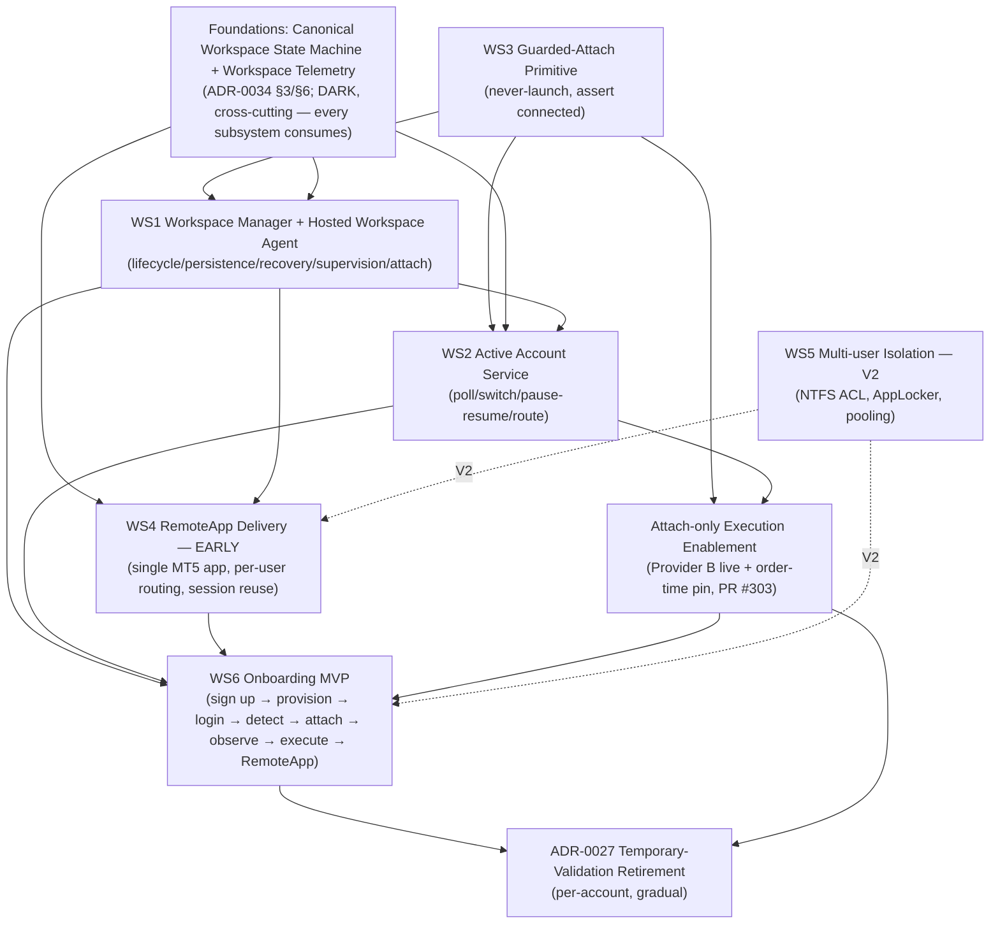

# Hosted Persistent MT5 Workspace — Implementation Roadmap (v2, post-reset)

- Status: **Proposed — pending Sponsor (PM) approval.** Planning only; no behaviour change, no flags armed,
  no host mutation.
- **Revised for the Programme Architecture Reset (2026-08-07, Sponsor-approved):** the product is now
  *"a hosted persistent MT5 workspace platform"* (not *"a backend that validates broker credentials"*).
  The **Workspace** is the primary entity; the broker account is a child resource.
- Architectural source of truth: **[ADR-0034 — Hosted Workspace Operating Model](../ADRs/0034-hosted-workspace-operating-model.md)**
  (draft), building on [ADR-0033](../ADRs/0033-hosted-persistent-mt5-workspace.md) + its Transition Amendment.
- Basis: the MT5 IPC investigation is **closed** (Experiments A–I). This roadmap is the production
  engineering plan, optimised for long-term architecture over next-smallest-feature.

**What the reset changed vs v1:** (a) RemoteApp delivery moves **early** (customer functionality *and*
engineering observability); (b) the canonical **Workspace state machine** + **workspace telemetry** become
cross-cutting foundations every subsystem consumes; (c) the Validation Agent is re-framed as the **Hosted
Workspace Agent** (validation becomes one capability); (d) the **MVP** is the full first customer journey
including RemoteApp; (e) multi-user pooling, licensing-cost optimisation, and advanced recovery move to **V2**.

---

## 0. What the experiments established (the pivot)

| Proven (A–I) | Consequence |
|---|---|
| Python attaches to a user-logged-in, broker-connected terminal (same- & cross-session); reads full state | GuvFX **observes + validates + executes** without owning credentials |
| Survives Guacamole/RDP disconnect; same PID; still connected + attachable | A persistent per-user workspace is viable |
| Requires broker connection — cold terminal → `-10005` | Readiness gates on a **fresh positive attach observation**, not a stored password |
| `initialize(path=)` is **dual-mode**: relaunches + auto-logs-in from cached `accounts.dat` if down | **WS3 Guarded-Attach is mandatory and first**: attach must *never launch* |
| `order_check` retcode 0 via attach; full lifecycle observed; `order_send`-via-attach runs in the `:8788` bridge | Attach-only execution is sound under the existing order-time gate |
| **Unproven / gating:** multi-tenant NTFS-ACL isolation (hard blocker), reliability/soak/concurrency, reboot→auto-reconnect, build 6073, RDS/SPLA licensing | Sets the gates, the V2 line, and (via RemoteApp-early) pulls licensing into MVP |

---

## 1. Dependency graph (v2)



**True hard edges:** attach-before-observe (`WS3 → WS1/WS2`), foundations-before-subsystems
(`FOUND → WS1/WS2/WS4`), workspace-before-service/delivery/onboarding (`WS1 → WS2/WS4/WS6`),
fresh-observation-before-execution (`WS2 → EXEC`). **WS5 (isolation) is deferred to V2** and only gates a
*multi-user/pooled* host — the MVP is dedicated-host-per-user.

---

## 2. Implementation order & parallelism (v2)

**Hard-sequenced spine:** `WS3 → FOUND → WS1 → {WS2, WS4} → WS6`.

- **WS3 Guarded-Attach is the first engineering increment** (recommended Increment 4): `initialize(path=)` is
  dual-mode, so a launch-instead-of-attach would relaunch + auto-log-in from cached `accounts.dat` and defeat
  the never-own-credentials premise. Zero host/licensing dependency; bounded/DARK.
- **FOUND (state machine + telemetry) comes next** — the reset mandates a single authoritative state model
  and mandatory workspace telemetry that *every* subsystem consumes; building them before WS1/WS2/WS4 avoids
  divergent per-subsystem interpretations.
- **WS1 (Workspace Manager + Hosted Workspace Agent) precedes WS2/WS4/WS6.**
- **WS2 (execution/observation) and WS4 (RemoteApp delivery) run in PARALLEL** after WS1 — disjoint layers
  (backend readiness/bridge vs Guacamole delivery). **RemoteApp is early**: it can serve a manually-staged
  workspace for observability while WS1/WS2 mature.
- **WS6 (Onboarding MVP)** is the integration join point.
- **WS5 (Multi-user Isolation) is V2** — the MVP's dedicated-host-per-user model has no cross-tenant surface,
  so the (still-missing) per-user NTFS ACL is not an MVP prerequisite.

---

## 3. Milestones (v2)

Gate legend: **Green** additive/DARK · **Amber** touches shared structure/host, documented decision · **Red**
live/paper execution, credential/production/host-ACL, or licensing — explicit Sponsor approval.

### M1 — Guarded-Attach Primitive (WS3) · **Amber** · DARK, bridge-local — *recommended Increment 4*
- Never-launch attach primitive replaces raw `mt5.initialize(**init_kwargs)` at all ~10 sites in
  `scripts/mt5_signal_bridge.py` (716, 1102, 1192, 1370, 1471, 1534, 1588, 1715, 1876, 2166): attach → assert
  `terminal_info().connected` → **fail closed, never launch** when no terminal is up.
- **Cold-start negative control:** with no terminal running, returns a guarded failure; never relaunches /
  auto-logs-in from cached `accounts.dat`.
- Shutdown semantics: `try/finally` must not `mt5.shutdown()` a terminal the bridge did not launch.
- Pure/fail-closed unit + **mutation** tests; RULE-11 positive+negative; no execution enablement, no host
  mutation. `evaluate_binding`/`verify_mutation_identity` authority unchanged.

### M2 — Foundations: canonical state machine + workspace telemetry · **Amber** · DARK
- Promote the ADR-0034 §3 canonical states (`Provisioning · WaitingForLogin · Connected · ExecutionReady ·
  Executing · Disconnected · Recovering · Suspended · Retired`) to the single authoritative model; map
  today's 9-state `WorkspaceState` onto it (mismatch/degraded/error → reason codes). Backward-compatible,
  additive, DARK.
- `workspace.*` telemetry family (ADR-0034 §6) emitted onto the ADR-0032 operational-event model —
  durable, correlation-tagged, secret-free; each event maps to a §3 transition/supervision fact.
- No subsystem may emit a workspace lifecycle claim or state outside these two foundations.

### M3 — Workspace Manager + Hosted Workspace Agent (single-tenant) + EXP-1 pilot (WS1) · **Red**
- Evolve the `:8791` Validation Agent into the **Hosted Workspace Agent** (supervise MT5, observe connection,
  guarded-attach, expose health, expose active account, recover, reconnect) — validation demoted to one
  capability; do not regress the current supervised/health/alert behaviour (ADR-0013).
- `HostedMt5Workspace` driven through the §3 state machine by real host observation via the guarded-attach
  primitive; emits `workspace.*` telemetry.
- **EXP-1 disposable-host pilot:** per-user terminal, **manual** broker login, attach→IPC + `order_check`
  retcode 0. Basic recovery (disconnect→reconnect) proven; WinSW bounded-backoff restart proven. 16-item
  checklist recorded. Nothing armed in prod.

### M4 — RemoteApp Delivery (EARLY) (WS4) · **Red** (RDS + licensing) · runs parallel to WS2 after WS1
- Single MT5 **seamless-window** app via the existing `guac_json` signing/encryption layer (not a full
  desktop iframe); **per-user dedicated routing + owner-bound observations** (ADR-0033 condition 3 / Tension 2),
  replacing the shared `GUAC_MT5_PASS`/hardcoded-host path for hosted accounts.
- Session reuse / reconnect-via-resume across RDP disconnect. Gated by `HOSTED_MT5_REMOTEAPP_ENABLED`.
- **Licensing prerequisite (reset):** RemoteApp needs the RDS role + a per-user CAL/SAL ⇒ the commercial
  licensing decision is required here (not V2). Dedicated-host-per-user ⇒ no WS5 isolation needed for MVP.

### M5 — Active Account Service + Provider B attach-only execution (WS2 + EXEC) · **Red**
- Host poller writes `observed_*` + `last_observed_at` **atomically**; `matching.evaluate_active_account_match`
  wired for switch-detection → `Suspended(reason=active_account_mismatch)` + pause; return-to-expected resumes.
- `PersistentWorkspaceProvider` eligible **only** on a fresh (≤300 s) positive attach observation ANDed with
  `is_active`/`disconnected_at`; fail-closed to `workspace_subsystem_disabled` when OFF.
- **PR #303 merged** (mandatory `MT5_REQUIRE_IDENTITY_PIN` at every `order_send`).
- One end-to-end attach-only **demo** order on an account with `readiness_provider='persistent_workspace'`
  (no `password_enc`, no `VALIDATED`), triple-dark.

### M6 — Onboarding MVP (WS1+WS2+WS4+WS6) · **Red** · ⭐ MVP
- Full journey: **sign up → workspace provisioned → user logs into MT5 → workspace detected → Python attaches
  → broker connection observed → ONE strategy executes safely → RemoteApp available**, GuvFX never
  receiving/storing/sealing the password and never calling `mt5.login()`.
- Account/Workspace Status shows truthful lifecycle from durable state + `workspace.*` telemetry.
- Dedicated-host-per-user; **RDS/SPLA licensing resolved** for the pilot cohort.
- Reversal path exercised: unset flags (immediate) + drop the additive `hosted_workspace` table leave the
  temporary-validation path intact.

### M7 — V2: Multi-user GA + isolation + retirement + advanced recovery (WS5, WS6) · **Red**
- WS5 NTFS-ACL backfill on `Provision-GuvfxAccount.ps1` (`icacls /inheritance:r`; Admins/SYSTEM Full;
  `guvfx_u_<id>` **Modify-not-Full** on its own tree; RULE-11 positive+negative — A cannot read B's
  `accounts.dat`) + AppLocker single-app + **first Windows-host execution** of the B3P-2 adapter; pooled
  hosting + capacity caps + licensing-cost optimisation.
- Advanced recovery: reboot → autologon → autolaunch → MT5 auto-reconnect from cached creds (end-to-end soak),
  crash-loop supervision.
- Per-account `temporary_validation → persistent_workspace` migration (never automatic; each evidenced); once
  no account depends on `password_enc`/`VALIDATED`, retire the ADR-0027 login stack (§4) — retain audit tables.
- Repo hygiene: remove `win_ops` stubs, `.bak.*` churn, `classification 2.py`, `/broker-accounts` redirect.

---

## 4. Temporary-validation obsolescence point

**Per-account trigger (begins):** `readiness_provider='persistent_workspace'` **and** `HOSTED_PERSISTENT_MT5_ENABLED`
on — Provider B proves eligibility from a fresh (≤300 s) positive attach observation ANDed with
`is_active`/`disconnected_at`, replacing **only** `password_enc`+`VALIDATED`. From that instant GuvFX never
receives/stores/seals/transports/logs-in-with the password for that account.

**Full-retirement point (delete):** when the **last** account is migrated and no account depends on
`password_enc`/`VALIDATED` as an eligibility authority, and the subsystem has left DARK. Per-account and
gradual; Provider A + ADR-0027 stay live for every un-migrated account. **Retain** append-only
`BrokerAccountValidationAttempt` history + TOMBSTONE rows.

---

## 5. Component inventory — keep / evolve / legacy / retire

| Disposition | Components |
|---|---|
| **Keep (unchanged)** | `execution/broker_gate.py` (central gate); `execution/readiness.py` abstraction + `evaluate_readiness`; bridge `evaluate_binding`/`verify_execution_binding`/`verify_mutation_identity` (order-time authority); `hosted_workspace/matching.py` (pure matcher); `BrokerAccountHealth` + `BrokerRuntimePause` sidecars; `install_pool.ps1 Sec.5` ACL template; TX-1 identity scripts (`Set-GuvfxKioskShell`, `Grant-GuvfxRdpAccess`, `Cleanup-GuvfxSessions`); `guac_json.py` signing core; ADR-0032 operational-event model. |
| **Evolve** | `hosted_workspace/models.py` `HostedMt5Workspace` → promote §3 states + re-anchor to **user-owned** (brokers as children); `flags.py` → add a hosted-workspace arming track; the `:8791` **Validation Agent → Hosted Workspace Agent** (validation = one capability); `readiness.PersistentWorkspaceProvider` → wired live; B3P-2 `win_slot_ops`/`slot_launch.ps1` + `GuvFXBetaAgent.supervised.xml` → per-user workspace supervision; onboarding/broker-accounts UI → workspace-centric. |
| **Legacy (maintain, do not extend)** | `TemporaryValidationProvider` (Provider A); `TradingAccount.password_enc`/`validation_status` as an **eligibility authority**; the ADR-0027 login-validation stack while any account is un-migrated; `broker_connectivity.run_broker_validation` (login-driven parts). |
| **Retire (only after last account migrated)** | `mt5_validate_worker.py`; `deploy/beta-agent/validate_login.py` + the `:8791 VALIDATE_LOGIN` op; `terminal_provisioning/broker_login_validation.py`; `broker_cred_envelope.py` (both copies); the build-5833 validation image; Provider A; `win_ops.RealWindowsOps` stubs; `.bak.*` cruft, `classification 2.py`, the `/broker-accounts` redirect. |

---

## 6. MVP boundary (redefined by the reset)

**MVP = M6:** the first end-to-end customer journey — **single-tenant, dedicated-host-per-user, demo-only**:

```
sign up → workspace provisioned → user logs into MT5 → workspace detected →
Python attaches (guarded) → broker connection observed → ONE strategy executes safely → RemoteApp available
```

Requires WS3 (guarded attach), FOUND (state machine + telemetry), WS1 (workspace lifecycle + basic recovery +
Workspace Agent), WS2 (active-account + Provider B attach-only demo), WS4 (**RemoteApp — early**), and the
**RDS/SPLA licensing decision**. Dedicated-host-per-user ⇒ WS5 multi-user isolation is **not** an MVP
prerequisite (no cross-tenant surface).

**V2 (explicitly deferred):** multi-user pooling + NTFS-ACL/AppLocker isolation; capacity/density +
**licensing-cost** optimisation; advanced recovery (reboot auto-reconnect at scale, crash-loop policy);
live trading (`MT5_ALLOW_LIVE` stays off through MVP).

**Reset tension (surfaced):** RemoteApp-in-MVP pulls the **RDS role + per-user CAL/SAL into the MVP** — so the
*commercial licensing decision* is an MVP-blocking prerequisite even though *cost optimisation* is V2.

---

## 7. Open risks

**Carried from v1:** (1) **WS5 NTFS-ACL hard blocker** (`Provision-GuvfxAccount.ps1` applies none → multi-user
host leaks `accounts.dat`; MVP avoids via dedicated host); (2) B3P-2 adapter **never executed on a Windows
host** (RULE 9/11 encoding traps; validate with the real 5.1 parser + positive/negative controls); (3) **PR
#303 unmerged** (M5 depends on it); (4) `last_observed_at` must be written **atomically** with `observed_*`;
(5) guarded-attach shutdown semantics; (6) unverified host assumptions (per-user attach EXP-1, reboot
auto-reconnect); (7) commercial licensing gate; (8) legacy identity-pin env fallback must be enforced before
Provider B.

**Introduced by the reset (see ADR-0034 §9):** (9) **licensing pulled into MVP** via RemoteApp-early;
(10) **state-machine migration** across consumers must be backward-compatible/ADR-governed; (11) **Workspace
re-anchoring** (account-owned → user-owned) must stay DARK/reversible; (12) **concept-churn / broad-refactor
temptation** — forbidden; safety gates + Customer Zero protections unchanged until individually replaced;
(13) **telemetry-first over-build** — emit only what each increment transitions; (14) **Workspace Agent
re-frame** must not regress the live `:8791` supervised behaviour.

---

## 8. Recommended Increment 4 (post-approval)

**Increment 4 = M1, the Guarded-Attach primitive (WS3).** Rationale: it is the safety foundation the Hosted
Workspace Agent's attach depends on, has **zero host/licensing dependency**, is fully bounded/DARK/additive,
directly neutralises the proven dual-mode `initialize` hazard, and was the pre-reset first-increment choice
the reset did not override. Deliver additive/DARK with pure + mutation tests and RULE-11 positive/negative
controls — after this roadmap + ADR-0034 are approved and **PR #303 merges**. **Increment 5** then = M2
foundations (state machine + telemetry). No host mutation, no execution enablement, nothing armed until then.
