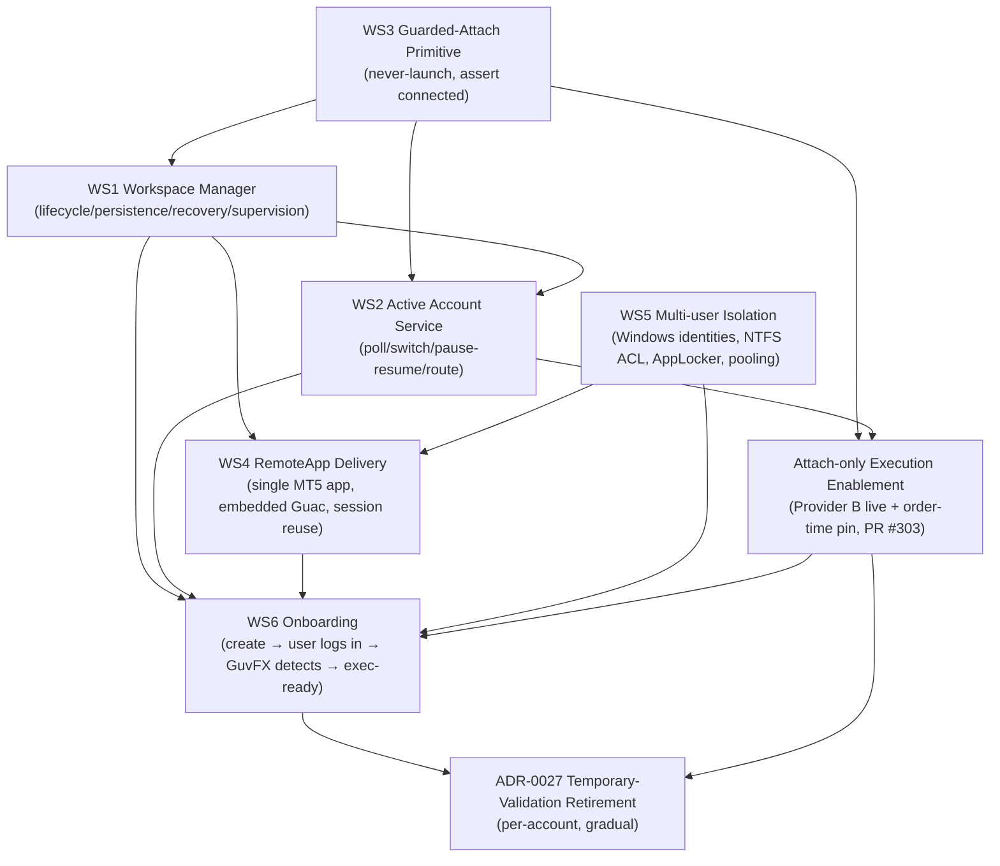

# Hosted Persistent MT5 Workspace — Implementation Roadmap

- Status: **Proposed — pending Sponsor (PM) approval.** Planning document only; no behaviour change, no
  flags armed, no host mutation. Git is authoritative for this roadmap; Notion owns lifecycle status.
- Supersedes nothing until approved. Governing decision: [ADR-0033](../ADRs/0033-hosted-persistent-mt5-workspace.md)
  (Accepted with conditions) + its **Transition Amendment** (proposed, same file).
- Basis: the MT5 IPC investigation is **closed** — Experiments A–I technically validated the persistent,
  attach-only (never-login, never-own-credentials) workspace. This roadmap turns that proof-of-concept into
  a production engineering programme, optimised for long-term architecture over next-smallest-feature.

This document answers, grounded in the current repository (not memory): the **dependency graph**, the
**implementation order**, **parallel vs hard-sequenced** work, **milestones M1…M7 with acceptance criteria
and Green/Amber/Red gates**, the **precise point the temporary-validation system becomes obsolete**, the
**reuse-unchanged vs retire-eventually** inventory, and the **MVP boundary** (first customer-usable version).

---

## 0. What the experiments established (the architectural pivot)

| Proven (A–I) | Consequence for the architecture |
|---|---|
| Python attaches to a user-logged-in, broker-connected terminal (same- & cross-session) and reads the full state | GuvFX can **observe + validate + execute** without owning credentials |
| Survives Guacamole/RDP disconnect; same PID; still connected + attachable | A persistent per-user workspace is viable (WS1/WS4 premise) |
| Requires broker connection — cold terminal → `-10005` | Readiness must gate on a **fresh positive attach observation**, not a stored password |
| `initialize(path=)` is **DUAL-MODE**: attaches if running, else **relaunches + auto-logs-in from cached `accounts.dat`** | **WS3 Guarded-Attach is mandatory and first**: the attach primitive must *never launch* |
| `order_check` retcode 0 through the attached session; full lifecycle observed; `order_send`-via-attach already runs in the production `:8788` bridge | Attach-only execution is sound with the existing order-time gate |
| **Unproven / gating:** multi-tenant NTFS-ACL isolation (hard blocker), reliability/soak/concurrency, reboot→auto-reconnect end-to-end, build 6073, RDS/SPLA licensing | These set the M4/M6/M7 gates and the MVP boundary |

---

## 1. Dependency graph

**True hard-dependency edges** (everything else is schedulable in parallel):
attach-before-observe (`WS3 → WS1/WS2`), workspace-before-service/delivery/onboarding
(`WS1 → WS2/WS4/WS6`), fresh-observation-before-execution (`WS2 → EXEC`), and
isolation-before-multi-user (`WS5 → WS4-shared/WS6-multiuser`).

---

## 2. Implementation order & parallelism

**Hard-sequenced spine:** `WS3 → WS1 → WS2 → EXEC → WS6`.

- **WS3 is first and is a genuine prerequisite**, not ceremony: because `initialize(path=)` is proven
  dual-mode, a launch-instead-of-attach would silently relaunch the terminal and auto-log-in from cached
  `accounts.dat` — defeating the entire *never-own-credentials* premise. WS1 (attach to observe/persist) and
  WS2 (attach to poll) both sit on this primitive.
- **WS1 precedes WS2/WS4/WS6** — the poller needs a persistent workspace and the `observed_*` cache it
  timestamps; delivery and onboarding serve a provisioned workspace.

**Runs in parallel:**
- **WS5 (Multi-user Isolation) starts on day one, alongside WS3.** It is host/provisioning PowerShell +
  RULE-11 certification (NTFS-ACL backfill, AppLocker) — independent of the WS3→WS1→WS2 code path. It is
  hard-sequenced **only** before a *multi-user/pooled* host, **not** before the single-tenant/dedicated-host
  pilot (a dedicated host has no cross-tenant filesystem surface).
- After **WS1** lands, **WS2** (backend readiness/observation) and **WS4** (Guacamole delivery) proceed in
  parallel — disjoint layers.
- **WS6** is the integration join point, hard-sequenced last.

---

## 3. Milestones (M1…M7)

Gate legend: **Green** = additive/behaviour-preserving/DARK; **Amber** = touches shared structure/gates/host,
needs a documented decision; **Red** = live/paper execution, credential/production/host-ACL, or licensing —
**explicit Sponsor approval required**.

### M1 — Guarded-Attach Primitive (WS3) · gate: **Amber** · DARK, bridge-local
- A **never-launch** attach primitive replaces raw `mt5.initialize(**init_kwargs)` at all ~10 sites in
  `scripts/mt5_signal_bridge.py` (lines 716, 1102, 1192, 1370, 1471, 1534, 1588, 1715, 1876, 2166): it
  attaches, asserts `terminal_info().connected`, and **fails closed** — never launches — when no terminal is up.
- **Cold-start negative control:** with no terminal running, the primitive returns a guarded failure and
  never relaunches / auto-logs-in from cached `accounts.dat` (guards the proven dual-mode hazard).
- **Shutdown semantics** defined so `try/finally` no longer calls `mt5.shutdown()` on a terminal the bridge
  did not launch (must not kill the user's session).
- Pure / fail-closed unit + **mutation** tests; RULE-11 positive+negative controls; **no** execution
  enablement, **no** host mutation; additive/DARK.
- `evaluate_binding` / `verify_mutation_identity` order-time authority **unchanged** — the primitive wraps
  the attach, it does not weaken the gate.

### M2 — Single-tenant Workspace Manager + EXP-1 disposable-host pilot (WS1) · gate: **Red**
- `HostedMt5Workspace` state machine (`NOT_PROVISIONED → PROVISIONING → AWAITING_USER_LOGIN → CONNECTED`,
  plus `DISCONNECTED/DEGRADED` recovery) driven by **real host observation** via the guarded-attach primitive.
- **EXP-1 disposable-host pilot:** attach-to-broker-connected IPC proven for a *per-user* terminal with a
  **manual** broker login (GuvFX never enters credentials); `order_check` retcode 0 via attach.
- **Reboot → MT5 auto-reconnect** from saved encrypted creds verified end-to-end (recovery without GuvFX
  holding the password).
- WinSW supervised profile (`GuvFXBetaAgent.supervised.xml`) applied; bounded-backoff restart proven on the
  disposable host.
- 16-item disposable-host pilot checklist recorded as evidence with limitations stated; nothing armed in prod.

### M3 — Active Account Service + Provider B attach-only execution live (WS2) · gate: **Red**
- Host poller populates `observed_connected/observed_trade_allowed/observed_is_demo` +
  `currently_attached_login/server`, writing `last_observed_at` **atomically** with the snapshot it dates
  (no stale snapshot on a fresh timestamp).
- `matching.evaluate_active_account_match` wired for switch-detection: a broker-account switch drives
  `ACTIVE_ACCOUNT_MISMATCH` and pauses; return-to-expected resumes (reuse `signal_copy` pause/resume).
- `PersistentWorkspaceProvider` returns eligible **only** on a fresh (≤300 s) positive attach observation
  ANDed with `is_active/disconnected_at`; fail-closed to `workspace_subsystem_disabled` when the flag is off.
- **PR #303 merged**: mandatory identity pin (`MT5_REQUIRE_IDENTITY_PIN`) enforced at every `order_send`
  (PLACE ×2 Inc2, CLOSE+MODIFY Inc3).
- End-to-end attach-only **demo** order on ONE account with `readiness_provider='persistent_workspace'`, **no**
  `password_enc`, **no** `VALIDATED`, triple-dark
  (`BROKER_CONNECTIVITY_EXECUTION_GATE` AND `HOSTED_PERSISTENT_MT5_ENABLED` AND `provider==persistent_workspace`).

### M4 — Multi-user Isolation + RULE-11 NTFS-ACL certification (WS5) · gate: **Red** · runs parallel from day one
- `Provision-GuvfxAccount.ps1` backfills the per-account NTFS ACL on `C:\GuvFX\accounts\<id>` (the
  `RuntimeRoot` foreach block): `icacls /inheritance:r`, then `Administrators (*S-1-5-32-544)` + `SYSTEM
  (*S-1-5-18)` Full, `guvfx_u_<id>` **Modify-not-Full** `((OI)(CI)M)` on its OWN tree only + RX on golden —
  mirroring the proven `install_pool.ps1 Sec.5` pattern.
- Idempotent and read-back-verified **by SID** (workgroup host; no `NTAccount` translation).
- **RULE-11 positive+negative proof:** `guvfx_u_A` **cannot** read `guvfx_u_B`'s `config\accounts.dat` or
  `profiles\`; a known-present ACE is found by the same parser (positive control).
- Modify-not-Full boundary preserved (no `FILE_DELETE_CHILD` on admin-owned files).
- AppLocker + single-MT5-app RemoteApp isolation on one RD host validated; `win_ops.RealWindowsOps` stubs
  retired for `win_slot_ops.RealSlotWindowsOps`.
- **First Windows-host execution** of the B3P-2 adapter (removes the "never executed on a Windows host" caveat).

### M5 — RemoteApp Delivery: single MT5 app, per-user routing, session reuse (WS4, WS5) · gate: **Amber**
- Single MT5 **seamless-window** app via the existing `guac_json` signing/encryption layer (not a full
  desktop in an iframe).
- **Per-user dedicated routing + authenticated owner-bound observations** wired (ADR-0033 condition 3 /
  Tension 2) — replacing the shared `GUAC_MT5_PASS` / hardcoded-host path for hosted accounts.
- Session reuse / reconnect-via-resume across RDP disconnect (consistent with the attach-survives-disconnect
  finding). Gated by `HOSTED_MT5_REMOTEAPP_ENABLED`; on a shared/pooled host requires M4.

### M6 — Onboarding MVP: attach-only, dedicated-host, customer-usable (WS1+WS2+WS4+WS6) · gate: **Red** · ⭐ MVP
- A customer completes: **create workspace → log into THEIR OWN broker in the delivered terminal → GuvFX
  detects the active account → readiness flips execution-ready → a demo signal executes attach-only**, with
  GuvFX never receiving/storing/sealing/transporting the password and never calling `mt5.login()`.
- Account Status shows **truthful** lifecycle (no false RUNNING/HEALTHY) from durable
  `AccountRuntime`/`HostedMt5Workspace` state.
- Commercial **RDS/SPLA licensing** gate (condition 5) resolved for the pilot cohort.
- Delivered on the **dedicated-host-per-user** model so multi-user NTFS-ACL pooling (M4) is **not** a blocker
  for first customer use.
- Reversal path exercised: unset flags (immediate) + drop the additive `hosted_workspace` table leave the
  temporary-validation path intact.

### M7 — Multi-user GA + per-account Temporary-Validation retirement (WS5, WS6) · gate: **Red**
- Multi-user pooled hosting on the RULE-11-certified isolated host (M4) with capacity caps.
- Accounts individually migrated `temporary_validation → persistent_workspace` (**never** auto-converted);
  each migration evidenced.
- Once **no** account depends on `password_enc`/`VALIDATED` for eligibility, the ADR-0027 login stack is
  retired (see §4) — while append-only `BrokerAccountValidationAttempt` history and TOMBSTONE rows are
  **retained**.
- Repo hygiene: remove `win_ops` stubs, `.bak.*` churn, `classification 2.py` duplicate, the `/broker-accounts`
  redirect once unreferenced.

---

## 4. Temporary-validation obsolescence point

**Per-account trigger (obsolescence *begins*):** for a given `TradingAccount`, `readiness_provider` is set to
`persistent_workspace` **and** `HOSTED_PERSISTENT_MT5_ENABLED` is on in production. At that instant
`execution/readiness.PersistentWorkspaceProvider` proves eligibility from a **fresh (≤300 s) positive attach
observation** (active-account match + connected + trade-allowed) ANDed with `is_active/disconnected_at` —
replacing **only** the `password_enc` + `validation_status==VALIDATED` eligibility layer (ADR-0033 condition 1).
From that point GuvFX never receives, stores, seals, transports, or logs in with the broker password for that
account.

**Full-retirement point (the login stack can be deleted):** when the **last** account has been migrated off
`temporary_validation`, no account depends on `password_enc`/`VALIDATED` as an eligibility authority, and the
subsystem has left DARK. Retirement is **per-account and gradual** — Provider A and the ADR-0027 system stay
live for every un-migrated account. **Retain** the append-only `BrokerAccountValidationAttempt` history and
disconnect TOMBSTONE rows (audit data; tables are not dropped).

---

## 5. Reuse unchanged vs retire eventually

### Reuse unchanged (foundations built to serve both models)
- `backend/execution/broker_gate.py` — the one central fail-closed execution gate; serves both providers.
- `backend/execution/readiness.py` — `ReadinessDecision` + provider abstraction + `evaluate_readiness`
  (Provider B is *wired/extended*; the abstraction is reused as-is).
- `scripts/mt5_signal_bridge.py::evaluate_binding / verify_execution_binding / verify_mutation_identity` —
  the **authoritative order-time boundary** that makes attach-only safe without `VALIDATED`. WS3 wraps the
  `initialize` sites; it does **not** modify the gate.
- `backend/hosted_workspace/` — `HostedMt5Workspace` (9-state machine, secret-free `contract()`, immutable
  binding), pure mutation-tested `evaluate_active_account_match`, `flags.py` (Idiom B, DARK).
- `BrokerAccountHealth` + `BrokerRuntimePause` sidecars — lifecycle/health/pause the gate ANDs for both providers.
- TX-1 identity scripts `Set-GuvfxKioskShell.ps1`, `Grant-GuvfxRdpAccess.ps1`, `Cleanup-GuvfxSessions.ps1`.
- `install_pool.ps1 Sec.5` ACL pattern — the **template** to backfill into TX-1 (not replaced).
- B3P-2 slot-pool machinery (`slot_launch.ps1`, `win_slot_ops.py`, `occupancy.py`, `win_mutations.py`) +
  `GuvFXBetaAgent.supervised.xml`.
- `backend/mt5/guac_json.py` signing/encryption core (WS4 extends routing on top).
- Onboarding/broker-accounts UI + `GET /api/reliability/trading-health/` (Viewer ≠ Trading).
- Governing docs: ADR-0033, `EXECUTION_READINESS.md`, `HOSTED_PERSISTENT_MT5_WORKSPACE.md`,
  `docs/operations/broker-connectivity/feature-flags.json` (extend with a hosted-workspace arming track).

### Retire eventually (only once the last account is migrated — §4)
- `mt5_worker/mt5_validate_worker.py` (+ `.bak.*`) — the credentialed `VALIDATE_LOGIN` driver.
- `deploy/beta-agent/validate_login.py` (`RealMt5Probe`/`LoginValidationHandler`) + the `:8791`
  `VALIDATE_LOGIN` op — the `mt5.initialize(login,password,server)` login step GuvFX no longer performs.
- `backend/terminal_provisioning/broker_login_validation.py` (`BrokerLoginValidator.validate`).
- `broker_cred_envelope.py` (backend + deploy copies) — the credential seal/transport path.
- Login-driven portions of `backend/trading/broker_connectivity.py::run_broker_validation`.
- `TradingAccount.password_enc` as a *stored credential* and `validation_status==VALIDATED` as an *eligibility
  authority* (columns/history retained for audit, not used as authority).
- `execution/readiness.TemporaryValidationProvider` (Provider A) — superseded once every account is migrated.
- The build-5833 validation image + ADR-0027 in-place login-validation primitive.
- `deploy/beta-agent/win_ops.py RealWindowsOps` stubs — superseded by `win_slot_ops.RealSlotWindowsOps`.
- `frontend/.../broker-accounts/page.tsx` redirect once unreferenced; `.bak.*` cruft, `classification 2.py`,
  duplicate ADR files.

---

## 6. MVP boundary (first customer-usable version)

**MVP = M6: a single-tenant, dedicated-host-per-user hosted persistent MT5 workspace.** The customer logs into
**their own** broker terminal; GuvFX **attaches** (never login, never own credentials) via the guarded-attach
primitive, detects the active account, flips readiness to execution-ready (Provider B), and executes **demo**
signals attach-only.

Why this line: it delivers the **entire product value proposition** — *"you keep your broker password; GuvFX
never holds it"* — with the smallest trustworthy footprint. It is drawn at **dedicated-host-per-user** (not
multi-user pooling) deliberately: dedicated hosting has **no cross-tenant filesystem surface**, so it does
**not** depend on WS5's still-missing per-user NTFS ACL (the hard blocker — `Provision-GuvfxAccount.ps1`
applies no ACL, so a multi-user host would leak `accounts.dat`). MVP therefore needs WS3 + WS1 + WS2 + WS4 +
the RDS/SPLA licensing decision, and **defers WS5 multi-user isolation to M7** as a cost/density
optimisation, not a functional prerequisite. **Demo-only** is the correct MVP rail (`MT5_ALLOW_LIVE` stays
off); the strengthened order-time identity pin already makes attach-only safe without `VALIDATED`.

---

## 7. Open risks (carried into execution)

1. **HARD SECURITY BLOCKER (WS5):** `Provision-GuvfxAccount.ps1` applies **no** NTFS ACL to
   `C:\GuvFX\accounts\<id>`, so `guvfx_u_<id>` inherit `BUILTIN\Users` R&X and any account can read any
   other's `config\accounts.dat`. Must be backfilled + RULE-11-certified before **any** multi-user host; MVP
   avoids it via dedicated-host-per-user.
2. **Dark-artefact / first-host risk:** the B3P-2 Windows adapter has **never executed on a Windows host**;
   ACLs/ACEs are asserted by off-host tests + hash pins only. Honour RULE 9/11 (validate every PS artefact
   with the real 5.1 parser; positive+negative controls).
3. **PR #303 (CLOSE/MODIFY identity gate) is unmerged + Sponsor-gated;** M3 depends on it landing.
4. **Cache-staleness correctness:** `last_observed_at` must be written **atomically** with the `observed_*`
   snapshot or a stale snapshot rides a fresh timestamp through the 300 s bound. Atomic writer not yet built.
5. **Guarded-attach shutdown semantics:** the ~10 `initialize` sites sit in `try/finally` that call
   `mt5.shutdown()`; shutting down an attached-not-owned terminal must be resolved without killing the
   user's session (M1 acceptance).
6. **Unverified host assumptions:** attach-to-connected generalising from the single production bridge to
   per-user terminals (EXP-1, manual login) and MT5 reboot→auto-reconnect from cached creds — both required
   for credential-free recovery.
7. **Commercial RDS/SPLA licensing (condition 5)** — a non-engineering blocker outside repo control; blocks
   any customer rollout.
8. **Legacy identity-pin fallback:** with `MT5_REQUIRE_IDENTITY_PIN`/payload flag unset, pins fall back to
   process-env and demo can run unpinned — the flag must be **enforced** before Provider B goes live.
9. **Governance/source-of-truth:** Notion owns lifecycle status; this roadmap + the ADR-0033 amendment must
   be cross-referenced into HANDOFF/STATUS/NEXT and Notion. Arming any hosted-workspace flag is **Red**
   (Sponsor-gated) and outside repo control.

---

## 8. Immediate next action (post-approval)

Begin **M1 — the Guarded-Attach primitive (WS3)** as the first engineering increment: a never-launch,
assert-connected attach wrapping the ~10 `initialize` sites in `scripts/mt5_signal_bridge.py`, additive/DARK,
with pure + mutation tests and RULE-11 positive/negative controls — after the roadmap is approved and PR #303
is merged.
