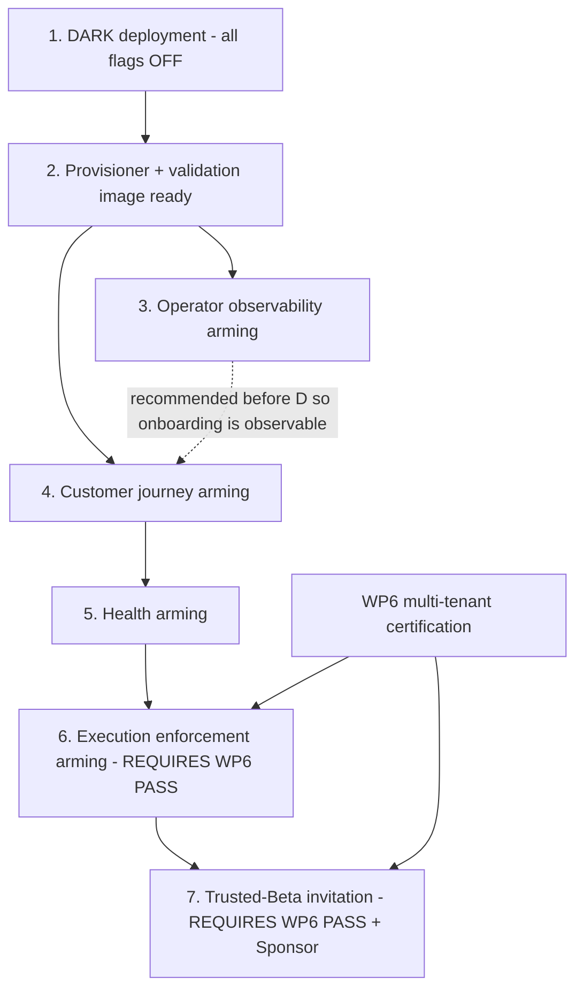

# Arming Runbook — Broker Connectivity (WP5.4 Workstreams B + D)

**This runbook arms nothing.** It defines the **only permitted enablement order** and, for each stage, the
preconditions, verification, stop condition, rollback and evidence. Every stage is **Sponsor-gated**. No
step in this document may be executed on the basis of this document alone; each requires a separate, explicit
Sponsor authorisation. Machine-readable copy of the sequence + partial states:
[`readiness-checklist.json`](readiness-checklist.json) → `arming_sequence`.

> **Safety principle.** The stages are ordered **observe → onboard → converge → enforce → invite**. Nothing
> that can place an order (`BROKER_CONNECTIVITY_EXECUTION_GATE`) is armed until WP6 PASS. Rollback is always
> "set the flag OFF" (backend) or "redeploy the DARK image" (frontend); no stage requires a destructive
> database rollback.

---

## Dependency graph

**Ordered enablement (the only permitted order):**

| # | Stage | Flags changed | WP6 first? | Sponsor gate |
|---|-------|---------------|-----------|--------------|
| 1 | DARK deployment | none | no | yes |
| 2 | Provisioner + validation image ready | none | no | yes |
| 3 | Operator observability arming | `OPERATIONS_EVENTS_ENABLED`, then rebuild `NEXT_PUBLIC_OPERATIONS_ENABLED` | no | yes |
| 4 | Customer journey arming | `BROKER_CONNECTIVITY_ENABLED`, then rebuild `NEXT_PUBLIC_BROKER_CONNECTIVITY_ENABLED` | no | yes |
| 5 | Health arming | `BROKER_CONNECTIVITY_HEALTH_ENABLED` | no | yes |
| 6 | Execution enforcement arming | `BROKER_CONNECTIVITY_EXECUTION_GATE` | **YES** | yes |
| 7 | Trusted-Beta invitation | none | **YES** | yes |

### Can customer onboarding be enabled before health and execution arming?

**Yes — and it is the intended order.** Stages 3–5 (observability, customer onboarding/validation, health)
place **no orders**. `VALIDATE_LOGIN` is a non-destructive broker-login probe (`shutdown()` in `finally`,
never `order_send`); onboarding stores credentials sealed and records validation state. Because
`BROKER_CONNECTIVITY_EXECUTION_GATE` stays OFF, **no exposure can be opened** regardless of onboarding
state. The constraint is absolute: **execution enforcement (stage 6) must not be armed until WP6 PASS**, and
until then the gate remains OFF so the platform's existing execution behaviour is unchanged. Health (stage
5) may precede the gate; health alone only emits signals — it never pauses, resumes, or executes.

### Prohibited orderings

- **Never** arm `BROKER_CONNECTIVITY_EXECUTION_GATE` (stage 6) before WP6 PASS (ADR-0029).
- **Never** invite Trusted-Beta users (stage 7) before WP6 PASS **and** explicit Sponsor arming approval.
- **Never** enable a `NEXT_PUBLIC_*` frontend flag without a matching **backend** flag state that avoids a
  customer-visible broken surface (a UI that only 404s) — see `customer_frontend_only` /
  `operator_frontend_only` in [rollback-matrix.md](rollback-matrix.md).
- **Never** arm the customer journey (stage 4) before the **provisioner + validation image are ready**
  (stage 2) — otherwise validation returns UNAVAILABLE for every customer.
- **Never** "enable all" in one action. Each stage is a distinct, reversible, Sponsor-gated change.

---

## Per-stage runbook

Each stage records: **Purpose · Component · Preconditions · Approved change · Verification · Expected
outcome · Failure symptoms · Immediate stop condition · Rollback · Evidence · Sponsor gate.** Flag values on
the host are **HOST-VERIFIED / OUTSIDE REPOSITORY CONTROL**.

### Stage 1 — DARK deployment

- **Purpose:** deploy the merged code and apply migrations with **all six flags OFF**.
- **Component:** backend image + `trading` / `operational_events` / `reliability` migrations; DARK frontend
  image (both `NEXT_PUBLIC_*` unset).
- **Preconditions:** `REPO-1..7`, `BE-1`, `HOST-6` (see [trusted-beta-readiness.md](trusted-beta-readiness.md));
  `make check` green; migrations consistent; golden STOP-check clean.
- **Approved change:** deploy image; run migrations (additive; see [rollback-matrix.md](rollback-matrix.md)
  → `migration_failure`). No flag set.
- **Verification:** all broker-connectivity routes 404; no nav entries; `manage.py makemigrations --check`
  clean; Customer Zero golden STOP-check byte-identical, zero orders.
- **Expected outcome:** production behaviour **identical** to before; capability present but dark.
- **Failure symptoms:** migration error; CI red; golden drift.
- **Immediate stop condition:** any migration failure, any golden STOP-check drift.
- **Rollback:** redeploy the prior image tag. The three apps' migrations are additive and safe to leave
  applied while flags are OFF (do not reverse them unless a defect requires it).
- **Evidence:** deploy log, migration output, golden STOP-check before/after, `make check` result.
- **Sponsor gate:** yes.

### Stage 2 — Provisioner + validation image ready

- **Purpose:** ensure the Windows agent + validation image can service `NEGOTIATE` / `VALIDATE_LOGIN`.
- **Component:** `deploy/beta-agent` bundle (re-staged **before/with** the backend per ADR-0014); the
  governed **build-5833** validation image; the **6073** rollback baseline retained.
- **Preconditions:** `HOST-1..5`. Agent bundle manifest integrity intact; `assert_compatible` passes at
  `NEGOTIATE`.
- **Approved change (host):** re-stage agent bundle; stage build-5833 validation image; verify via
  `validation_image.verify_image`; keep 6073 as rollback. **HOST-VERIFIED / OUTSIDE REPOSITORY CONTROL.**
- **Verification:** `NEGOTIATE` returns the full `PROVISIONING_OPERATIONS` set; `verify_image` PASS
  (≥100 run-in `.ex5`, source hashes match); isolation checks pass.
- **Expected outcome:** the validation path is ready; no customer sees it yet (customer flag still OFF).
- **Failure symptoms:** `protocol_version_mismatch` / `unsupported_operations`; `source_hash_drift`;
  `isolation_check_failed`; `validation_baseline_dirty`.
- **Immediate stop condition:** any of the above.
- **Rollback:** revert the active validation terminal to the **6073** baseline (a directory/config swap; the
  probe is side-effect-free, so no estate/DB impact). Re-stage the correct agent bundle.
- **Evidence:** `verify_image` output, `NEGOTIATE` response, image provenance/manifest hashes.
- **Sponsor gate:** yes.

### Stage 3 — Operator observability arming (DARK-safe first)

- **Purpose:** record and view operational events **before** customers are onboarded, so onboarding is
  observable from the first customer.
- **Component:** backend `OPERATIONS_EVENTS_ENABLED`; then a frontend **rebuild** with
  `NEXT_PUBLIC_OPERATIONS_ENABLED` (operator-only, read-only).
- **Preconditions:** stage 1 complete; `BE-4` (owner-scoping verified); `OPS-2` (support owner named).
- **Approved change:** (a) set `OPERATIONS_EVENTS_ENABLED` ON (runtime; no restart); (b) rebuild + deploy
  the frontend with `NEXT_PUBLIC_OPERATIONS_ENABLED` set.
- **Verification:** `GET /api/operations/account-events/?account_id=<staff-owned>` returns `{summary,
  timeline}` for staff; a non-staff owner sees only their own `customer_visible` events; a non-owner gets
  **404**. Operator UI renders read-only; no write actions exist. Watch logger `guvfx.operational_events`
  for recorder failures.
- **Expected outcome:** operators can observe events; the read model is projection-only and fail-open.
- **Failure symptoms:** recorder-failure log spike; API 5xx; owner-scoping check fails.
- **Immediate stop condition:** owner-scoping failure (cross-account visibility) — treat as SEV-1
  ([incident-response.md](incident-response.md)); recorder-failure spike.
- **Rollback:** set `OPERATIONS_EVENTS_ENABLED` OFF (immediate DARK); redeploy the DARK frontend image. A
  corrupt projection is cleared by disabling the flag — the read model re-accretes **forward** once re-armed.
  **There is no backfill tool:** truncating the `OperationalEvent` table permanently drops historical rows
  (authoritative state is unaffected), so never truncate expecting reconstruction.
- **Evidence:** owner-scoping test transcript, recorder-failure log sample (should be empty), API responses.
- **Sponsor gate:** yes.

### Stage 4 — Customer journey arming

- **Purpose:** let customers add / validate / manage broker accounts (still **no execution**).
- **Component:** backend `BROKER_CONNECTIVITY_ENABLED` (needs the **signing keyring** — `BE-3`); then a
  frontend **rebuild** with `NEXT_PUBLIC_BROKER_CONNECTIVITY_ENABLED`.
- **Preconditions:** stages 1–2 complete; stage 3 recommended (so onboarding is observable); `BE-2`
  (backend seal-only), `BE-3` (signing keyring provisioned), `OPS-1` (disposable demo accounts for any
  test), `OPS-5` (Customer Zero excluded from any destructive/concurrent test).
- **Approved change:** (a) set `BROKER_CONNECTIVITY_ENABLED` ON; (b) rebuild + deploy the frontend with the
  customer flag.
- **Verification:** a demo account can be added and validated → `HEALTHY / demo_ok / is_demo=true`; a live
  account classifies as `live_detected`; an invalid credential returns `NEEDS_ATTENTION` (not retryable); a
  platform fault returns `UNAVAILABLE` (retryable). No order is placed anywhere. Customer Zero untouched.
- **Expected outcome:** the customer broker-account journey is live for onboarding/validation only.
- **Failure symptoms:** validation `UNAVAILABLE` storm; `isolation_check_failed` / `impl_integrity_mismatch`
  (platform-integrity faults); any credential-handling anomaly.
- **Immediate stop condition:** credential-handling anomaly (any hint of secret exposure) → **SEV-1**;
  widespread `isolation_check_failed`.
- **Rollback:** set `BROKER_CONNECTIVITY_ENABLED` OFF (surface returns 404 immediately); redeploy the DARK
  frontend.
- **Evidence:** demo/live/invalid/unavailable validation transcripts (masked), CZ no-drift, credential-access
  audit sample.
- **Sponsor gate:** yes.

### Stage 5 — Health arming

- **Purpose:** converge per-account broker health on customer validation evidence (signals only).
- **Component:** backend `BROKER_CONNECTIVITY_HEALTH_ENABLED`.
- **Preconditions:** stage 4 complete (health converges on customer validation, not a background poller).
- **Approved change:** set `BROKER_CONNECTIVITY_HEALTH_ENABLED` ON.
- **Verification:** a validation success moves an `UNKNOWN` account to `HEALTHY`; sustained failures move it
  to `DEGRADED`/`DISCONNECTED` after the failure threshold; `state_version` increments by exactly one per
  net change; **the scheduler stays inert** (`run_cycle` has no validator). No auto-resume occurs.
- **Expected outcome:** health state reflects validation evidence; **no pause/resume/execution effect** yet
  (the execution gate is still OFF).
- **Failure symptoms:** health not converging; unexpected DEGRADED/DISCONNECTED distribution; the scheduler
  unexpectedly performing live validation (it must not).
- **Immediate stop condition:** the scheduler performing live validation; health flapping.
- **Rollback:** set `BROKER_CONNECTIVITY_HEALTH_ENABLED` OFF; the engine no-ops instantly. **No auto-resume
  exists**, so there is no runtime process to stop.
- **Evidence:** per-account `get_contract` transitions, `state_version` monotonicity, scheduler
  `{ran:false}` proof.
- **Sponsor gate:** yes.

### Stage 6 — Execution enforcement arming — **REQUIRES WP6 PASS**

- **Purpose:** refuse to open exposure for ineligible accounts (the only stage that changes whether an order
  is placed).
- **Component:** backend `BROKER_CONNECTIVITY_EXECUTION_GATE` (+ pause/resume active with health).
- **Preconditions:** **WP6 PASS** (multi-tenant isolation + concurrency proven); stages 1–5 complete;
  `OPS-4` (arming window + stop conditions), `OPS-6` (rollback rehearsed). Per ADR-0029 this stage is
  gated on WP6 and Sponsor approval.
- **Approved change:** set `BROKER_CONNECTIVITY_EXECUTION_GATE` ON (with `BROKER_CONNECTIVITY_HEALTH_ENABLED`
  ON for health-driven refusal/pause).
- **Verification:** an ineligible account's exposure-opening job is blocked at **creation**, failed at
  **claim**, and refused at **dispatch**; an eligible account trades unchanged; refusals audit
  `EXECUTION_GATE_REFUSED` / `EXECUTION_DISPATCH_REFUSED`. **Zero** ineligible executions permitted.
- **Expected outcome:** exposure only opens for `VALIDATED`, eligible accounts.
- **Failure symptoms:** execution refused for **eligible** accounts (refusal spike); worse — an ineligible
  account permitted to execute (**SEV-1**).
- **Immediate stop condition:** any ineligible execution permitted (**SEV-1**); a refusal spike for eligible
  accounts.
- **Rollback:** set `BROKER_CONNECTIVITY_EXECUTION_GATE` OFF — the gate becomes **transparent instantly**
  (short-circuits before any DB read). If health inputs are suspect, set `BROKER_CONNECTIVITY_HEALTH_ENABLED`
  OFF too.
- **Evidence:** ineligible-refusal proof at all three points, eligible-passes-unchanged proof, refusal-rate
  sample, CZ no-drift.
- **Sponsor gate:** yes (+ WP6 PASS).

### Stage 7 — Trusted-Beta invitation — **REQUIRES WP6 PASS + explicit Sponsor approval**

- **Purpose:** admit the explicit, capacity-limited Trusted-Beta cohort.
- **Component:** the beta admission/onboarding path (out of the broker-connectivity flag domain; governed by
  the beta onboarding programme).
- **Preconditions:** all Trusted-Beta entry criteria in [trusted-beta-readiness.md](trusted-beta-readiness.md)
  met; explicit Sponsor arming approval; a named cohort and capacity limit; agreed stop conditions.
- **Approved change:** invite the agreed cohort only.
- **Verification:** each invited user is within the cohort/capacity limit; monitoring
  ([monitoring-spec.md](monitoring-spec.md)) and support ([support-playbook.md](support-playbook.md)) are
  live; incident ownership assigned.
- **Immediate stop condition:** any SEV-1; cohort/capacity limit reached; support/incident capacity
  exceeded.
- **Rollback:** **pause invitations** (existing users unaffected); if needed, execute the stage-6 rollback
  (disarm the execution gate) to stop new exposure.
- **Evidence:** cohort list, capacity limit, Sponsor approval record, monitoring/support readiness sign-off.
- **Sponsor gate:** yes (+ WP6 PASS).

---

## Verification quick-reference (per flag)

| Flag | DARK proof | Armed proof |
|------|-----------|-------------|
| `OPERATIONS_EVENTS_ENABLED` | API `/api/operations/account-events/` → 404 | `{summary,timeline}` returned; recorder-failure log empty |
| `NEXT_PUBLIC_OPERATIONS_ENABLED` | `/operations/accounts` → 404, no nav | operator UI renders read-only |
| `BROKER_CONNECTIVITY_ENABLED` | WP1A endpoints → 404 | demo validation → `HEALTHY/demo_ok` |
| `NEXT_PUBLIC_BROKER_CONNECTIVITY_ENABLED` | `/broker-accounts` → 404, no nav | Broker Accounts UI renders |
| `BROKER_CONNECTIVITY_HEALTH_ENABLED` | `get_contract` → `None` | validation moves state; `state_version` +1/net change |
| `BROKER_CONNECTIVITY_EXECUTION_GATE` | no extra DB read; `gate_disabled` | ineligible blocked at create/claim/dispatch |
