# Hosted Signed-Executor — Security Review

**Audience:** Chief Architect · Security reviewer · Future maintainers
**Scope:** the Stream 7C hosted signed-executor daemon (`deploy/hosted-executor/`) + the shared contract it
implements (`backend/hosted_workspace/host_protocol.py`, `host_agent_dispatch.py`) and the reviewed Windows
primitives it drives (`backend/terminal_provisioning/windows/*.ps1`).
**Status:** repository-complete, adversarially reviewed (0 surviving HIGH/MEDIUM), **DARK / not deployed**
(`HOSTED_HOST_EXECUTOR_ENABLED` unset). Deployment + live certification are a separate Sponsor-gated packet
(`HOSTED_EXECUTOR_DEPLOY_RUNBOOK.md`). See ADR-0039 (builds on ADR-0036/0037/0038).

**One-line thesis.** The daemon is the *only* code that turns a request into a host action, and it is
deliberately incapable of arbitrary execution: the wire cannot express a command, script, path, username, or
task; the host derives identity and every path from `account_id`; each allow-listed operation maps to exactly
one reviewed `.ps1` executed as a fixed argument vector; and Customer Zero is refused twice.

---

## Phase 1 — Request lifecycle

```mermaid
sequenceDiagram
    autonumber
    participant DJ as Django (SignedHostExecutor)
    participant NET as Tailscale (private iface)
    participant D as daemon.py (HTTP listener)
    participant DP as host_agent_dispatch.dispatch
    participant HP as host_protocol.verify_hosted_request
    participant PR as primitive_runner.run
    participant PS as reviewed .ps1
    participant WIN as Windows

    DJ->>DJ: sign_hosted_request (HMAC over canonical body; nonce; ttl; params/payload digests)
    DJ->>NET: POST /hosted/provision  (account_id + operation + typed params [+ sealed payload])
    NET->>D: TCP (exact private bind only; bounded body; read-deadline watchdog)
    D->>DP: handle(req)  reserved={1}∪cfg ; max_skew from cfg
    DP->>HP: verify (proto ver → op allow-list → fields present → key known → acct>0 → skew/expiry → HMAC → params_digest → payload_digest → nonce_burn)
    HP-->>DP: validated fields  (or HostProtocolError → 200 denied, unsigned)
    DP->>DP: refuse reserved/CZ ; derive_slot(account_id) ; _validate_params ; _build_args
    Note over DP: PROVISION_IDENTITY only: envelope_open(payload) → plaintext password (AAD-bound)
    DP->>PR: run(primitive, server-derived args)
    PR->>PR: CONTRACT lookup → script_path (confined) → fixed argv → password→stdin
    PR->>PS: powershell -NoProfile -NonInteractive -ExecutionPolicy Bypass -File <fixed.ps1> <named args>
    PS->>WIN: New-LocalUser / ACL / RemoteApp / AppLocker / … (idempotent, read-back)
    PS-->>PR: one compact JSON line (ok + reason/rows/…)
    PR-->>DP: {ok, …}  (ok ∧ exit0)
    DP->>DP: sign_hosted_response (HMAC binds result to correlation_id+nonce)
    DP-->>DJ: signed response  → DJ verify_hosted_response (fail closed on any mismatch)
```

**Narrative.** The Django `SignedHostExecutor` signs a request whose body carries only `operation` (from a fixed
allow-list), `account_id` (an int), a small typed `params` dict, and — for `PROVISION_IDENTITY` — a sealed
Windows password. It POSTs to `base_url + "/hosted/provision"`. The daemon accepts the connection **only** on the
exact configured private interface, bounds the body size, and arms a wall-clock read-deadline watchdog; it hands
the parsed JSON to `dispatch`, which **verifies** the request, **refuses** Customer Zero, **derives** the Windows
identity and every path from `account_id`, **maps** the operation to exactly one reviewed primitive, **runs** it
via the primitive runner (fixed argument vector; password to stdin), and **signs** the response. The backend
verifies that signature, so a forged or relayed response is rejected.

---

## Phase 2 — Trust boundaries

```mermaid
flowchart LR
    subgraph Untrusted
      NET[Any network peer]
    end
    subgraph B1[Private interface — Tailscale + firewall]
      direction TB
      RAW[Raw bytes: request line, headers, body]
    end
    subgraph B2[Authenticated after HMAC verify]
      FIELDS[Validated signed fields]
    end
    subgraph B3[Confined slot identity]
      SLOT[guvfx_u_&lt;id&gt; + fixed paths + alias]
    end
    subgraph B4[Windows primitive layer]
      RUN[One reviewed .ps1, fixed argv]
    end
    subgraph B5[NT SERVICE\\GuvFXHostedExecutor least-priv]
      HOST[Per-account ACL / AppLocker / RemoteApp]
    end
    NET -->|"exact-bind + bounded body + watchdog"| RAW
    RAW -->|"verify_hosted_request: HMAC + nonce + skew/expiry"| FIELDS
    FIELDS -->|"refuse CZ/reserved + derive_slot(account_id)"| SLOT
    SLOT -->|"OP_PRIMITIVES allow-list + _build_args"| RUN
    RUN -->|"powershell -File fixed.ps1 (no shell, no -Command)"| HOST
```



| Boundary | Trusted side | Untrusted side | How trust is established |
|---|---|---|---|
| **B1 network** | the exact private/Tailscale interface | the public internet, any other NIC | `daemon_config.assert_exact_bind` pins the bind host; wildcard/public/loopback/alternate refused (`daemon_config.py:62,67`); forbidden ports `{3389,8787,8788,8791}` (`:32`). The Tailscale ACL + host firewall gate reachability. |
| **B2 authentication** | a request bearing a valid HMAC over the canonical body | raw bytes on the socket | `verify_hosted_request` (`host_protocol.py:126`) — proto version, op allow-list, all signed fields present, known `key_id`, `account_id>0`, skew (`:154`), expiry (`:156`), `_MAX_EXPIRY_WINDOW` (`:157`), constant-time HMAC (`:161`), `params_digest` (`:166`), `payload_digest` (`:175`), then **single-use nonce burn** (`:178`). Nothing acts before this passes. |
| **B3 confinement** | a slot identity derived from `account_id` | any `account_id`/path/username the caller *sends* | the caller sends only `account_id`; the host **derives** `guvfx_u_<id>` + `C:\GuvFX\accounts\<id>` + the RemoteApp alias in `derive_slot` (`host_agent_dispatch.py:101`). Customer Zero is refused first (`:146`). There is nowhere on the wire to put a path or username. |
| **B4 execution** | one reviewed `.ps1` invoked with server-derived scalars | any command/script the caller might want to run | `OP_PRIMITIVES` allow-list (`:60`) → `primitive_runner.CONTRACT` (`primitive_runner.py:55`) → `script_path` confinement (`:147`) + ParseFile gate (`:164`) + fixed argument vector (`:182`), never a shell string, never `-Command`. |
| **B5 privilege** | the signed protocol + allow-listed primitives (NOT the OS token) | the host, other tenants, Customer Zero | the daemon runs as `LocalSystem` (ADR-0040): provisioning inherently needs admin/SYSTEM (create local user, NTFS ACL, RDP/RemoteApp), so the security boundary is the HMAC-signed, replay-protected, nine-primitive allow-list with server-derived slot paths + Customer-Zero refusal — reviewed to 0 surviving HIGH. Elevating the token does not widen what a valid-signature caller can cause; primitives still write only per-account NTFS ACLs / AppLocker tenant fragments / a per-account RemoteApp alias; CZ is never provisioned. |

**Where each control lives (summary):** signatures + replay + skew are verified at **B2**
(`host_protocol.verify_hosted_request`); identity + all paths are derived at **B3** (`derive_slot`); the Customer
Zero floor exists at **B3 twice** (daemon unconditional `{1}` union `daemon.py:63` **and** dispatch reserved
check `host_agent_dispatch.py:146-148`); execution authority begins at **B4** (`primitive_runner.run`) and
touches Windows only at **B5** through a fixed argv.

---

## Phase 3 — Security properties (mechanism + evidence)

| Property | Mechanism | Evidence |
|---|---|---|
| **Arbitrary command execution impossible** | The wire has no command field; execution is `subprocess.run([...list...], shell=False)` — a fixed argv, never a shell string. No `-Command`/`-EncodedCommand`. | `primitive_runner.py:117` (`shell=False`, list argv), `:258` `run` builds `[powershell, -NoProfile, -NonInteractive, -ExecutionPolicy, Bypass, -File, <fixed .ps1>] + flags`. Tests: `tests_host_primitive_runner.ArgVectorTests.test_never_uses_shell_string`, and the whole argv is asserted per primitive. |
| **Arbitrary path impossible** | No path is on the wire; `derive_slot` builds every path from `account_id`; `script_path` refuses any filename containing a separator and any path escaping the scripts dir (`commonpath`). | `host_agent_dispatch.py:101-116`; `primitive_runner.py:147-155` (`os.path.basename(filename)!=filename` → refuse; `commonpath != scripts_dir` → refuse). Test: `test_script_path_rejects_traversal`. |
| **Arbitrary username impossible** | Username is `guvfx_u_<id>` derived from `account_id`; the runner re-derives `-AccountId` from that username via a strict regex and refuses anything else. | `host_agent_dispatch.py:107`; `primitive_runner.py:176` (`^guvfx_u_([1-9][0-9]*)$`). Test: `test_account_id_underivable_from_bad_username`. |
| **Arbitrary script impossible** | A primitive *name* (from `OP_PRIMITIVES`) maps to exactly one fixed `.ps1` filename in `CONTRACT`; unknown → fail closed; `verify_slot` (no script) fails closed. | `host_agent_dispatch.py:60`; `primitive_runner.py:55` (`CONTRACT`), `:258` (unknown→`unknown_primitive`, `script=None`→`*_unimplemented`). Tests: `test_unknown_primitive_fails_closed`, `test_verify_slot_unimplemented`, `test_contract_covers_exactly_dispatch_primitives`. |
| **Replay protection** | A durable single-use nonce is burned atomically **after** the signature verifies; a replay returns False → `nonce_replayed`. | `host_protocol.py:178` calls `nonce_burn`; `nonce_store.py:30` `INSERT OR IGNORE` + `rowcount==1` (`:38`); durable across restart (SQLite file). Tests: `tests_host_nonce_store`, `tests_host_daemon.HandlerTests.test_replay_refused`. |
| **Nonce lifecycle** | First use → burned (True); replay → False; expired nonces pruned by `purge_expired` (bounded storage) once per request. | `nonce_store.py:30,42`; `daemon.py:69` purges each request. Test: `test_purge_expired_removes_only_expired`, `test_durable_across_reopen`. |
| **Timestamp validation** | `abs(now-ts) > max_skew` → `timestamp_skew`; `now > expiry` → `request_expired`; `expiry-ts > 600` → `expiry_too_far`. Operator skew is honoured (threaded through `dispatch`). | `host_protocol.py:154,156,157`; `host_agent_dispatch.py:139-140` (`max_skew_seconds` thread-through). Tests: `test_timestamp_skew_refused`, `test_configured_skew_is_enforced`, `test_default_skew_accepts_within_30s`. |
| **Signature verification** | HMAC-SHA256 over a canonical, sorted body; constant-time compare; only after that is the nonce burned or any action taken. | `host_protocol.py:160-161` (`hmac.compare_digest`). Test: `test_bad_signature_refused`. |
| **Response authentication** | The host signs its response (HMAC binds `result` to `correlation_id`+`nonce`); the backend verifies it → a MITM cannot forge a "clean" ACL read-back. | `host_protocol.py:191` (sign), `:200-213` (verify). Test: `test_signed_request_returns_verified_signed_response`; denials are unsigned so the backend fails closed (`test_customer_zero_refused`). |
| **Sealed password transport** | The Windows password is sealed to the host public key (ADR-0027 X25519→HKDF→AES-256-GCM); the AEAD AAD binds `(operation, account, correlation_id, nonce)`; only the host holds the private key; never argv/env/log. | seal: `host_executor._default_seal_password`; open: `envelope_open.py:64-67` (AAD byte-identical), `:41-49` (key by envelope `key_id`); password → stdin only (`primitive_runner.py:219-230`). Tests: `tests_host_envelope_open` (round-trip + wrong-account/nonce/key/malformed all fail closed), `test_provision_injects_accountid_and_routes_password_to_stdin`. |
| **Customer Zero exclusion** | Two independent layers: the daemon unions `{1}` into the reserved set unconditionally; dispatch refuses any `account_id in reserved`. Neither can be disabled by config. | `daemon.py:63` (`reserved = frozenset(base) | frozenset({1})`); `host_agent_dispatch.py:146-148`. Tests: `test_customer_zero_refused`, `test_reserved_empty_string_still_refuses_customer_zero` (empty/whitespace/tabs). |
| **Account/path binding** | Every path a primitive receives is derived from the same `account_id` (`derive_slot`); the Django executor also confines username↔runtime_root before sending. | `host_agent_dispatch.py:101-116`, `_build_args:164`; `host_executor._confined`. |
| **Primitive allow-list** | `OP_PRIMITIVES` (dispatch) and `CONTRACT` (runner) must cover exactly the same primitive names; params outside a per-op allow-list are rejected. | `host_agent_dispatch.py:60`, `_validate_params:119`; `primitive_runner.py:55`; drift guard `tests_host_daemon_packaging.test_contract_covers_exactly_dispatch_primitives`. |

---

## Phase 4 — Failure analysis

For each: **expected result / rollback / customer impact.** The transport is fail-closed throughout — a failure
leaves canonical state at `PROVISIONING` (the slot-prep orchestrator does not advance), and a customer is never
told "log in" behind an unprepared slot.

| Failure | Expected result | Rollback | Customer impact |
|---|---|---|---|
| **Bad signature** | `verify_hosted_request` → `bad_signature`; 200 denied (unsigned); backend fails closed. | none needed (no action taken). | none. |
| **Expired request** | `request_expired` / `expiry_too_far`; denied. | none. | none. |
| **Replay** | `nonce_replayed` (durable store); denied. | none (the first use already ran or was rejected). | none. |
| **Wrong account (CZ/reserved)** | `reserved_identity` at both layers; denied before any derivation. | none. | none; Customer Zero untouched. |
| **Wrong runtime (path mismatch)** | Django `confinement_mismatch` before send; host re-derives paths so a mismatched path cannot be expressed. | none. | none. |
| **Unknown primitive** | `unknown_primitive` (runner) / `operation_not_allowed` (protocol); fail closed. | none. | none. |
| **Missing secret** | daemon refuses to **start** (`daemon_config` fail-closed on missing/placeholder HMAC or envelope key). | n/a (never serves). | none (no half-armed executor). |
| **Wrong key id** | `unknown_key_id`; denied. | none. | none. |
| **Dispatcher failure** (unexpected exception) | daemon handler returns 500 `internal_error` (sanitised, logged without body/secret). | none; state not advanced. | none; ret/-safe. |
| **PowerShell failure** (non-zero exit) | `ok = (exit0 ∧ script.ok)`; a non-zero exit → not ok, reason surfaced (`reason`/`error`). | the slot-prep orchestrator rolls the ACL back to its snapshot on ACL failure; other steps leave state at `PROVISIONING`. | the workspace stays unprepared; a later retry re-drives idempotently. |
| **Primitive verification failure** (e.g. G5 ACL read-back wrong) | signed response carries the read-back rows; the backend `verify_workspace_acl` fails → `apply` is not accepted; the executor calls `rollback_workspace_acl`. | DACL restored from the pre-apply snapshot. | none; no leaking/half-applied ACL persists. |
| **Host unavailable** (network/timeout) | Django transport exception → `host_unavailable` (ambiguous → fail closed, sanitised). | none; state not advanced. | provisioning simply does not progress; safe to retry. |
| **Timeout** (primitive) | `primitive_timeout` (subprocess `TimeoutExpired`), child killed. | none; retry-safe. | slot unprepared; retry. |
| **Partial execution** (crash mid-primitive) | reviewed primitives are idempotent + read-back verified; a re-run re-asserts the same state. On stop, the **drain** lets an in-flight op finish before the socket closes. | idempotent re-drive; ACL self-rolls-back on its own control failure. | none observable; re-run converges. |

---

## Phase 5 — Threat model (attack classes → mitigations)

| Attack class | Capability assumed | Mitigation |
|---|---|---|
| **Remote attacker** (internet) | can send packets | cannot reach the daemon: exact private-interface bind + Tailscale ACL + host firewall. Even on-interface, no HMAC key → every request `bad_signature`/`unknown_key_id`. Pre-auth resource use is bounded (body size, connection cap, read-deadline watchdog). |
| **Compromised Django backend** | can mint validly-signed requests | **the host distrusts the backend by design**: it re-refuses Customer Zero/reserved, re-derives identity + all paths from `account_id`, and can only express allow-listed operations mapping to reviewed `.ps1`. No command/path/username/script is expressible, so the worst case is bounded provisioning of a **non-CZ** slot — not RCE, not CZ compromise, not secret exfiltration. |
| **Compromised host** | already root on the box | out of scope for this transport (it *is* the host). The design limits what the *transport* can add: least-privilege service identity, no new code-execution surface, no secret written to disk beyond the machine secret store the operator controls. |
| **Malicious operator** | can set env / edit config | some actions require operator trust by definition (they hold the machine secrets). The daemon still fails closed on placeholder/missing secrets, refuses non-expected bind interfaces, and **cannot** be configured to drop the Customer Zero floor (daemon unions `{1}` regardless of `HOSTED_EXECUTOR_RESERVED_ACCOUNT_IDS`). |
| **Tenant breakout** | a validly-signed request for account N | account N derives only account N's identity/paths/alias; there is no field to name account M; per-account NTFS ACL + AppLocker tenant fragment + per-account RemoteApp alias keep runtimes disjoint (ADR-0038). |
| **Path traversal** | attacker-influenced path | no path on the wire; `script_path` refuses separators + `commonpath` escape; primitives receive only `derive_slot` paths. |
| **Command injection** | attacker-influenced argv | fixed argv list, `shell=False`, no `-Command`; a value beginning `-` or containing control chars is refused (`primitive_runner.py:197`, `:199`). |
| **Credential theft** | wants the Windows/broker password | the password is sealed to the host public key (backend cannot decrypt what it sealed), AAD-bound to the request, opened only in memory on the host, delivered to the child on **stdin**, never argv/env/log; `_sanitise_result` strips secret-keyed fields from any response. |
| **Replay** | captured a valid request | durable single-use nonce + short TTL/skew → a delivered request cannot be replayed even across a daemon restart. |
| **MITM** | on the wire between backend and host | HMAC on the request **and** the response (bound to correlation_id+nonce) → neither a forged request nor a forged "clean" ACL read-back is accepted; the AEAD AAD additionally binds the sealed password to the request context. |

---

## Phase 6 — Code traceability

| Security property | Code |
|---|---|
| Signed wire contract; canonical body; digests | `backend/hosted_workspace/host_protocol.py` (`sign_hosted_request:88`, `_canonical_body`, `params_digest_of:71`, `payload_digest_of:76`) |
| Signature verify; skew/expiry; nonce burn; response auth | `host_protocol.py:126-185` (`compare_digest:161`, `timestamp_skew:154`, `request_expired:156`, `nonce_burn:178`); `sign_hosted_response:191`, `verify_hosted_response:200` |
| Verify → refuse CZ → derive → validate → map → run → sign | `backend/hosted_workspace/host_agent_dispatch.py` (`dispatch:131`, `verify call:140`, `reserved:146`, `derive_slot:101`, `_validate_params:119`, `_build_args:164`, `run_primitive call:155`, `sign response:160`) |
| Customer Zero hard floor (host-side layer) | `host_agent_dispatch.py:55` (`DEFAULT_RESERVED_ACCOUNT_IDS`), `:80-98` (`reserved_ids_from`), `:146-148` |
| Per-account identity/paths/alias | `host_agent_dispatch.py:40` (`remoteapp_alias`), `:101-116` (`derive_slot`) |
| Primitive allow-list; params allow-list | `host_agent_dispatch.py:60` (`OP_PRIMITIVES`), `:119` (`_validate_params`) |
| Primitive → reviewed `.ps1`; ParseFile gate; fixed argv; password→stdin; verdict | `deploy/hosted-executor/primitive_runner.py` (`CONTRACT:55`, `script_path:147`, `verify_scripts:164`, `_build_argv:182`, `_stdin_bytes:219`, `subprocess:117`, `_parse_result:232`, `run:258`) |
| HTTP listener; exact-bind; bounded body/conn; read-deadline watchdog; drain; crash→non-zero | `deploy/hosted-executor/daemon.py` (`build_dispatch_handler:54`, unconditional CZ floor `:63`, skew thread `:65,73`, `_force_close:108`, `_disarm_deadline:114`, `do_POST:140`, `server_bind/SO_EXCLUSIVEADDRUSE:185`, `process_request cap:194`, `_track_inflight:261`, `make_server/assert_exact_bind:282`, `stop drain:310`) |
| RULE-3 config; fail-closed secrets; forbidden ports; bind pin; placeholder gates | `deploy/hosted-executor/daemon_config.py` (`FORBIDDEN_BIND_PORTS:32`, `_looks_placeholder:77`, `_load_keyring:82`, `assert_exact_bind:67`, envelope keyring gate `:146-153`) |
| Durable single-use nonce | `deploy/hosted-executor/nonce_store.py` (`burn:30`, `purge_expired:42`) |
| Host private-key envelope open; AAD binding | `deploy/hosted-executor/envelope_open.py` (`make_envelope_opener:51`, `_private_key_for:41`, AAD `:64`); `lib/broker_cred_envelope.py` (vendored, drift-guarded) |
| Reviewed Windows primitives (least-priv, idempotent, read-back) | `backend/terminal_provisioning/windows/*.ps1` — `Provision-GuvfxAccount.ps1` (password via **stdin**), `Set-GuvfxWorkspaceAcl.ps1` (G5 ACL Apply/Verify/Rollback), `Populate-GuvfxViewerRuntime.ps1`, `Set-GuvfxAutoTradingConfig.ps1`, `Grant-GuvfxRdpAccess.ps1`, `Set-GuvfxSingleSession.ps1`, `Set-GuvfxRemoteApp.ps1`, `Set-GuvfxObserver.ps1`, `Set-GuvfxAppLockerTenant.ps1` |
| Installer: WinSW hash-pin, identity, ParseFile-gate, rollback | `deploy/hosted-executor/install_service.ps1`, `winsw/*.xml` |

---

## Phase 7 — Reviewer checklist (one page)

A future reviewer should be able to verify each of these directly against the code:

- [ ] **Signatures.** No action (not even a nonce burn) occurs before `verify_hosted_request` passes; HMAC uses
  `hmac.compare_digest` over a canonical, sorted body; responses are signed and the backend verifies them.
  (`host_protocol.py:126-185,191-213`)
- [ ] **Replay.** `nonce_burn` is called **after** the signature verifies and is a durable atomic
  `INSERT OR IGNORE` (first use True, replay False); expired nonces are pruned. (`host_protocol.py:178`,
  `nonce_store.py:30,42`)
- [ ] **Time.** Skew, expiry, and max-expiry-window are all enforced; the operator skew knob is actually
  threaded through (`host_protocol.py:154-158`, `host_agent_dispatch.py:139-140`).
- [ ] **Primitives.** `OP_PRIMITIVES` == `CONTRACT` keys (drift guard); each maps to one fixed reviewed `.ps1`;
  execution is a list argv with `shell=False`, no `-Command`; ParseFile-gated at startup; unknown/`verify_slot`
  fail closed. (`primitive_runner.py:55,117,147,164,258`)
- [ ] **CZ protection.** Account 1 is refused at both layers; the daemon unions `{1}` unconditionally so config
  cannot disable it. (`daemon.py:63`, `host_agent_dispatch.py:146`)
- [ ] **Secrets.** HMAC keyring, envelope private keyring both loaded fail-closed with placeholder gates; the
  password is sealed (AAD-bound), opened only in memory, delivered on stdin, never argv/env/log; responses are
  secret-sanitised. (`daemon_config.py:82,146`, `envelope_open.py`, `primitive_runner.py:219`,
  `host_agent_dispatch._sanitise_result`)
- [ ] **Rollback.** ACL failures roll back to the DACL snapshot; other failures leave state at `PROVISIONING`;
  the emergency-stop path unsets the flag + stops the service (drains first). (`slot_preparation.py`,
  `HOSTED_EXECUTOR_DEPLOY_RUNBOOK.md`)
- [ ] **Logging.** Request bodies, paths, nonces, and secrets are never logged; only sanitised reason codes +
  lifecycle events. (`daemon.py` `log_message` no-op; `_send`/handler)
- [ ] **AppLocker assumptions.** The tenant merge is additive (`NotConfigured` fragment; `-Merge`), never a
  machine-wide replace; removing Customer Zero is refused; the publisher-based posture is preserved (ADR-0038).
- [ ] **RemoteApp assumptions.** Per-account alias `guvfx_mt5_<id>` derived server-side (Customer Zero keeps
  `terminal64`); FilterByName (no full desktop); the descriptor derives the same alias (no IDOR). (ADR-0038)

---

## Phase 8 — ADR cross-references

- **ADR-0036** — Host Provisioning Engine (`prepare_hosted_slot`, G5 NTFS ACL): the orchestrator this daemon is
  the executor for.
- **ADR-0037** — Signed Host Executor: the wire contract + dispatch logic + Django client this daemon binds.
- **ADR-0038** — Multi-tenant isolation (AppLocker merge model + per-account RemoteApp alias): the isolation
  guarantees the primitives uphold.
- **ADR-0039** — Hosted Executor Daemon: this daemon; records the build, the adversarial review outcome, and the
  residuals. This security review is its companion document.

**Residuals (stated, RULE 7):** `VERIFY_SLOT` is unimplemented on this host build (fails closed;
off the `prepare_hosted_slot` path). The Django client's 30 s read timeout vs a long `MATERIALISE_RUNTIME`
(~378 MB copy) needs poll-not-repost before the live certification — a deployment-packet concern.
